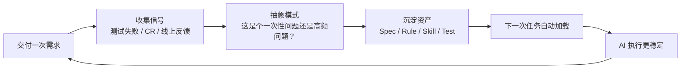

# 资产飞轮机制

> **TL;DR**：一次经验如果没有沉淀为资产，下次仍然要靠人提醒。沉淀为资产后，AI 会在后续任务中自动获得这部分上下文。

## 你能在这里学到

- 为什么要沉淀资产
- 资产类型：Specs / Rules / Skills / Tests / Reviews
- 资产沉淀原则
- 资产飞轮的工作机制

## 前置知识

阅读本篇需要你先了解：

- [设计理念：人机分工](./design-philosophy)

## 一、为什么要沉淀资产

AI Native 的长期收益来自复利。一次提示只能解决一次问题，资产可以持续约束后续任务。

```text
一次经验 → 抽象规律 → 固化资产 → 自动加载 → 后续同类问题减少
```

## 二、资产类型

| 资产 | 主要内容 | 复用方式 |
|------|----------|----------|
| **Specs** | 需求目标、模块边界、接口契约、验收标准 | 作为 AI 实施前的任务契约 |
| **Plans** | 执行步骤、文件清单、风险点、验证方式 | 作为 AI 编码时的路线图 |
| **Rules** | 高频规范、路径规则、禁止项 | 在特定文件路径自动注入上下文 |
| **Skills** | 稳定 SOP、组件知识、项目流程 | 让 AI 按固定步骤完成重复工作 |
| **Tests** | 业务规则、回归场景、边界条件 | 作为机器可执行护栏 |
| **Reviews** | 风险分析、影响面、遗漏项 | 反向更新 Rules、Tests 和 Skills |

## 三、资产沉淀原则

| 原则 | 说明 |
|------|------|
| 高频才规则化 | 一次性知识放文档，高频约束放 Rule |
| 流程才 Skill 化 | 需要按步骤执行的工作沉淀为 Skill |
| 行为才测试化 | 能用输入输出描述的业务规则沉淀为测试 |
| 决策要归档 | 方案取舍、边界、不做什么要写入 spec 或 plan |
| 失败要反哺 | 测试失败、CR 问题、线上问题都要转成新资产 |

## 四、从问题到资产

| 发现的问题 | 优先沉淀为 | 示例 |
|------------|------------|------|
| AI 经常写错命名 | Rule | 命名规范、目录规范、函数前缀 |
| AI 经常猜组件 API | Skill | 组件查询 Skill、demo 索引、参数说明 |
| AI 经常漏某个边界 | Test | 空状态、异常状态、身份差异 |
| AI 经常改错架构层 | Spec / Plan | 模块边界、文件职责、改动范围 |
| CR 反复指出同类风险 | Rule / Review 模板 | 影响面检查、状态来源检查 |

## 五、资产飞轮



核心循环：**交付 → 收集信号 → 抽象模式 → 沉淀资产 → 自动加载 → 执行更稳定 → 交付**。

## 六、验收标准

一次 AI Native 交付完成后，至少回答这些问题：

- [ ] 新增业务规则是否有测试保护
- [ ] 新增架构约束是否写入 spec 或 plan
- [ ] 新发现的高频坑是否应该进入 Rule
- [ ] 新流程是否值得沉淀为 Skill
- [ ] CR 结论是否归档，是否需要反哺测试

## 参考

- [资产沉淀机制](https://github.com/anthropics/claude-code) — AI Native 工程实践（访问于 2026-08-19）

## 下一步

- 建立质量保障 → [TDD 质量保障](./tdd-quality)
- 了解迁移路径 → [迁移路径](./migration-guide)

## 如果你想

- 理解设计理念 → [设计理念：人机分工](./design-philosophy)
- 改造架构 → [三层架构与模块模板](./three-layer-architecture)
- 看工具对比 → [AI Coding 工具全景](/ai-coding/tools/overview)
