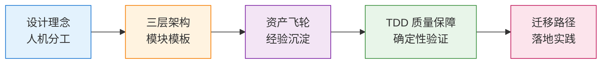

# AI Native 架构

> **TL;DR**：AI Native 不是"在传统流程里加 AI 助手"，而是以 AI 为默认执行者重新设计研发链路。

## 你能在这里学到

- AI Native 是什么，它改变了什么
- 如何让工程结构对 AI 友好（三层架构、模块模板）
- 如何把经验沉淀为可复用资产（资产飞轮）
- 如何用 TDD 收敛 AI 的概率性产出
- 如何从现有项目迁移到 AI Native

## 章节地图

## 分组概览

| 章节 | 解决的问题 |
|------|------------|
| [设计理念](./design-philosophy) | AI Native 是什么，人机如何分工 |
| [三层架构](./three-layer-architecture) | 如何让工程结构对 AI 友好 |
| [资产飞轮](./asset-flywheel) | 如何把经验沉淀为可复用资产 |
| [TDD 质量保障](./tdd-quality) | 如何用测试收敛 AI 的概率性产出 |
| [迁移路径](./migration-guide) | 如何从现有项目迁移到 AI Native |

## 从哪里开始

**你的情况是……**

| 场景 | 从这里开始 |
|------|------------|
| 还没理解 AI Native | [设计理念](./design-philosophy) |
| 想改造项目结构 | [三层架构](./three-layer-architecture) |
| 想建立质量保障 | [TDD 质量保障](./tdd-quality) |
| 想全面迁移 | [迁移路径](./migration-guide) |

## 下一步

- 理解理念 → [设计理念：人机分工](./design-philosophy)
- 改造架构 → [三层架构与模块模板](./three-layer-architecture)
- 建立质量 → [TDD 质量保障](./tdd-quality)

## 如果你想

- 看工具对比 → [AI Coding 工具全景](/ai-coding/tools/overview)
- 学习 Claude Code → [Claude Code 精通](/claude-code/)
- 团队工作流 → [团队 AI 工作流](/ai-coding/workflows/team)
