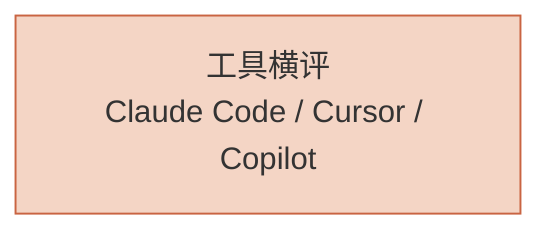

# AI Coding 落地

> 不只讲原理，讲怎么选工具、怎么把 AI 编程真正用到你的项目里。

## 谁应该读这一章

- 正在评估 AI Coding 工具的团队负责人
- 想把 AI 集成到研发流程的工程师
- 需要为团队做技术选型的负责人

## 章节地图

## 分组概览

**工具横评** — Claude Code / Cursor / GitHub Copilot / Codex CLI / Trae / PI-agent / DeepSeek Harness 的深度对比

> AI Native 工程方法论（设计理念 / 三层架构 / 资产飞轮 / TDD 质量 / 迁移路径）与团队工作量、常见模式，已迁出到顶级导航 [AI Harness 工程](/ai-harness/)。

## 从哪里开始

**你的情况是……**

| 场景 | 从这里开始 |
|------|-----------|
| 还没选工具 | [AI Coding 工具全景](/ai-coding/tools/overview) |
| 已在用 Claude Code | [Claude Code 深度评测](/ai-coding/tools/claude-code) |
| 想把 AI 嵌入团队流水线 | [团队 AI 工作流](/ai-harness/workflows/team) |
| 想了解 AI 辅助编码模式 | [代码重构模式](/ai-harness/patterns/refactor) |
| 想理解 AI Harness 工程 | [AI Harness 工程](/ai-harness/) |

## 下一步

- 看工具对比 → [工具全景](/ai-coding/tools/overview)
- 深入 Claude → [Claude Code 精通](/claude-code/)
- 学习原理 → [AI 核心技术](/ai-core/)

## 如果你想

- 看团队工作量与编码模式 → [AI Harness 工程](/ai-harness/)
- 看实战案例 → [Cookbook](/cookbook/)
- 选模型 → [模型选型决策树](/ai-trends/model-selection/model-selection-guide)
