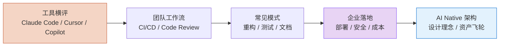

# AI Coding 落地

> 不只讲原理，讲怎么把 AI 编程真正用到你的项目里。

## 谁应该读这一章

- 正在评估 AI Coding 工具的团队负责人
- 想把 AI 集成到开发流程的工程师
- 需要企业级部署方案的技术决策者

## 章节地图

## 分组概览

**工具横评** — Claude Code / Cursor / GitHub Copilot / Codex CLI / Trae 深度对比  
**团队工作流** — 团队 AI 工作流设计、CI/CD 集成、Code Review 自动化  
**常见模式** — 代码重构、测试生成、文档生成的最佳实践  
**企业落地** — 部署方案、安全合规、成本控制  
**AI Native 架构** — 设计理念、三层架构、资产飞轮、TDD 质量保障、迁移路径

## 从哪里开始

**你的情况是……**

| 场景 | 从这里开始 |
|------|-----------|
| 还没选工具 | [AI Coding 工具全景](/ai-coding/tools/overview) |
| 已在用 Claude Code | [Claude Code 深度评测](/ai-coding/tools/claude-code) |
| 想引入团队 | [团队 AI 工作流](/ai-coding/workflows/team) |
| 企业级部署 | [企业部署指南](/ai-coding/enterprise/deployment) |
| 想理解 AI Native | [AI Native 架构](/ai-coding/architecture/) |

## 下一步

- 看工具对比 → [工具全景](/ai-coding/tools/overview)
- 深入 Claude → [Claude Code 精通](/claude-code/)
- 理解原理 → [AI 核心技术](/ai-core/)

## 如果你想

- 看实战案例 → [Cookbook](/cookbook/)
- 选模型 → [模型选型决策树](/ai-trends/model-selection/model-selection-guide)
