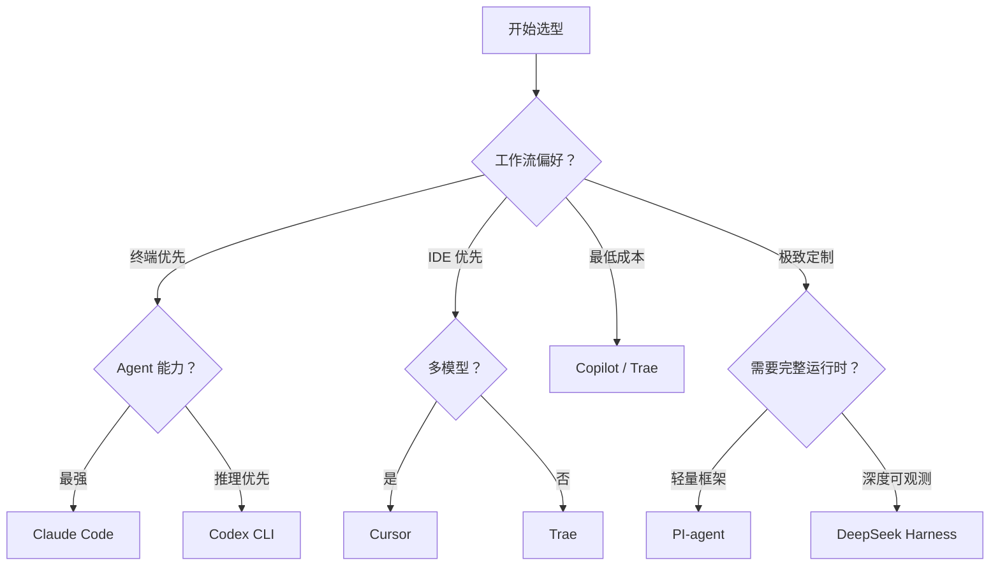

# AI Coding 工具全景

> **TL;DR**：7 大工具、3 种形态——CLI（Claude Code / Codex）、IDE（Cursor / Trae）、插件（Copilot）、框架（PI-agent / DeepSeek Harness）。选型看你的工作流偏好。

⏱ 预计阅读时间：8 分钟

## 你能在这里学到

- 7 大 AI Coding 工具的核心差异
- 产品 vs 框架的本质区别
- CLI vs IDE vs 插件三种形态的优劣
- 价格、能力、适用场景的横向对比
- 如何根据团队情况选型

## 7 大工具速查

| 工具 | 厂商 | 形态 | 定价 | 核心特色 |
|------|------|------|------|----------|
| **Claude Code** | Anthropic | CLI | $20-200/月 | Agent 能力最强、MCP 生态 |
| **Cursor** | Cursor Inc. | IDE | $20-40/月 | AI-native IDE、多模型支持 |
| **GitHub Copilot** | Microsoft/GitHub | 插件 | $10-39/月 | 生态最大、VS Code 集成最深 |
| **Codex CLI** | OpenAI | CLI | 按 token | 推理能力最强 |
| **Trae** | 字节跳动 | IDE | 免费 | 中文优化、免费 |
| **PI-agent** | Earendil | CLI 框架 | 免费 MIT | 极简框架、15+ 模型、极致扩展 |
| **DeepSeek Harness** | DeepSeek | Agent 框架 | 免费 MIT | 插件一切、Cordis 内核、144k Star |

## 三种形态

### CLI 形态（Claude Code / Codex CLI / PI-agent）

**优势**：
- 终端原生，不离开命令行
- Agent 能力完整（文件、Shell、搜索、Web）
- 可脚本化、可 CI 集成
- 不依赖特定 IDE

**劣势**：
- 没有 GUI 预览
- 学习曲线较高
- 需要熟悉终端操作

### IDE 形态（Cursor / Trae）

**优势**：
- 完整 IDE 体验（调试、Git、插件）
- 代码预览、diff 可视化
- 学习曲线低

**劣势**：
- 绑定特定 IDE
- Agent 能力受限于 IDE 框架
- 不可脚本化

### 插件形态（Copilot）

**优势**：
- 集成到现有 IDE（VS Code / JetBrains）
- 最低学习成本
- 生态最大

**劣势**：
- Agent 能力最弱
- 依赖 IDE 版本
- 定制化有限

### 框架形态（PI-agent / DeepSeek Harness）

**优势**：
- 极致可扩展（插件/扩展系统）
- 不绑定特定模型或 IDE
- 可嵌入其他应用（SDK 模式）
- 开源免费

**劣势**：
- 需要大量配置和组装
- 学习曲线最陡
- 缺乏开箱即用体验
- 生态成熟度参差不齐

## 能力对比

| 能力 | Claude Code | Cursor | Copilot | Codex CLI | Trae | PI-agent | DeepSeek Harness |
|------|-------------|--------|---------|-----------|------|----------|-----------------|
| **代码补全** | ✅ | ✅ | ✅ | ✅ | ✅ | ✅ | ✅ |
| **对话式编程** | ✅ | ✅ | ✅ | ✅ | ✅ | ✅ | ✅ |
| **Agent 能力** | ⭐⭐⭐ | ⭐⭐ | ⭐ | ⭐⭐⭐ | ⭐⭐ | ⭐⭐（需扩展） | ⭐⭐⭐（插件） |
| **MCP 生态** | ⭐⭐⭐ | ⭐⭐ | ⭐ | ⭐ | ⭐ | ⭐（扩展可选） | ⭐（插件可选） |
| **多模型支持** | ⭐⭐ | ⭐⭐⭐ | ⭐⭐ | ⭐ | ⭐⭐ | ⭐⭐⭐（15+） | ⭐⭐（插件扩展） |
| **CI/CD 集成** | ⭐⭐⭐ | ⭐ | ⭐⭐ | ⭐⭐⭐ | ⭐ | ⭐⭐ | ⭐⭐ |
| **中文优化** | ⭐⭐ | ⭐⭐ | ⭐⭐ | ⭐⭐ | ⭐⭐⭐ | ⭐⭐ | ⭐⭐⭐ |
| **可扩展性** | ⭐⭐ | ⭐⭐ | ⭐ | ⭐ | ⭐ | ⭐⭐⭐ | ⭐⭐⭐⭐ |
| **可观测性** | ⭐⭐ | ⭐ | ⭐ | ⭐ | ⭐ | ⭐ | ⭐⭐⭐⭐ |

## 价格对比

| 工具 | 免费版 | Pro | Team/Enterprise |
|------|--------|-----|-----------------|
| Claude Code | 有限额度 | $20/月 | $200/月 |
| Cursor | 有限额度 | $20/月 | $40/月 |
| Copilot | 公共仓库 | $10/月 | $39/月 |
| Codex CLI | 按 token | 按 token | 按 token |
| Trae | 免费 | — | — |
| PI-agent | 免费 MIT | — | — |
| DeepSeek Harness | 免费 MIT | — | — |

## 选型决策树



**经验法则**：

- **终端老手 + Agent 需求强** → Claude Code
- **IDE 用户 + 多模型需求** → Cursor
- **团队 + 最低成本** → Copilot
- **中文场景 + 预算有限** → Trae
- **高级用户 + 极简定制** → PI-agent
- **需要深度可观测性** → DeepSeek Harness

## 跨工具规范：AGENTS.md 标准

团队内多人使用不同 AI Coding 工具时，**规则文件不兼容**是最大痛点。行业已收敛到一套标准：

### AGENTS.md 标准

由 OpenAI 联合 Google、Anthropic 等厂商推出的跨工具规范，已被 Codex、Claude Code、Cursor、Trae、PI-agent、DeepSeek Harness、Devin、GitHub Copilot 等主流工具采用：

| 文件 | 作用域 |
|------|--------|
| 仓库根 `AGENTS.md` | 全仓库通用规则 |
| 子目录 `AGENTS.md` | 仅作用于该目录及子目录（天然"路径作用域"） |
| `AGENTS-{task}.md` | 单任务特化规则 |
| `AGENTS-{language}.md` | 语言特化（如 `AGENTS-Python.md`） |
| `~/.agents/AGENTS.md` | 用户全局规则 |

### 各工具规则文件对比

| 工具 | 主规则文件 | 路径作用域 | AGENTS.md 兼容 |
|------|-----------|-----------|---------------|
| **Claude Code** | `CLAUDE.md`（多级加载） | 子目录 CLAUDE.md | ✅ 新版同时读取，CLAUDE.md 优先 |
| **Codex** | `AGENTS.md`（只认此文件） | 子目录 AGENTS.md | ✅ 原生支持 |
| **Cursor** | `.cursor/rules/*.md`（glob） | glob 路径匹配 | ✅ 兼容读取 |
| **Trae** | `.trae/rules/*.md`（glob）+ AGENTS.md | glob + 子目录 AGENTS.md | ✅ 原生支持 |
| **Copilot** | `.github/copilot-instructions.md` | — | ⚠️ 有限 |
| **PI-agent** | `AGENTS.md` + `SYSTEM.md` | 子目录 AGENTS.md | ✅ 原生支持 |
| **DeepSeek Harness** | `AGENTS.md` + Cordis 插件 | 子目录 AGENTS.md | ✅ 原生支持 |

### 多工具团队的最佳实践

```
repo/
├── AGENTS.md                    # 跨工具通用规范（主入口）
├── CLAUDE.md                    # Claude 专属（hooks/skills，薄引用 AGENTS.md）
├── .cursor/rules/               # Cursor 专属（如需 glob 控制）
├── .trae/skills/                # Trae 专属技能
├── src/pages/AGENTS.md          # pages 目录规则（Codex/Trae/Claude 均可读）
└── src/common/AGENTS.md         # common 目录规则
```

**核心原则**：
- **AGENTS.md 当主入口**：唯一 Codex/Claude/Cursor/Trae 通吃的文件
- **目录级 AGENTS.md 替代 path-scoping frontmatter**：Codex 原生支持，其他工具也兼容
- **工具专属文件只放该工具特有的东西**：hooks、skills、MCP 配置
- **单一权威源**：详细内容放 `docs/`，规则文件只做引用，避免双份漂移
- **长度控制**：规则文件 ≤200 行，避免上下文膨胀

## 常见坑

**工具不是万能**

AI Coding 工具是"辅助"，不是"替代"。核心设计、架构决策仍需人工。

**多工具混用**

团队内不同人用不同工具，可能导致代码风格不一致。建议统一——用 AGENTS.md 做跨工具规范。

## 参考

- [Claude Code 官方文档](https://code.claude.com/docs)
- [Cursor 官方文档](https://docs.cursor.com)
- [GitHub Copilot 文档](https://docs.github.com/copilot)
- [模型选型决策树](/ai-trends/model-selection/model-selection-guide)

## 下一步

- 深入 Claude Code → [Claude Code 深度评测](./claude-code)
- 深入 Cursor → [Cursor 深度评测](./cursor)
- 深入 PI-agent → [PI-agent 深度评测](./pi-agent)
- 深入 DeepSeek Harness → [DeepSeek Harness 深度评测](./deepseek-harness)
- 团队引入 → [团队 AI 工作流](../workflows/team)

## 如果你想

- 选模型 → [模型选型决策树](/ai-trends/model-selection/model-selection-guide)
- 看实战案例 → [Cookbook](/cookbook/)
