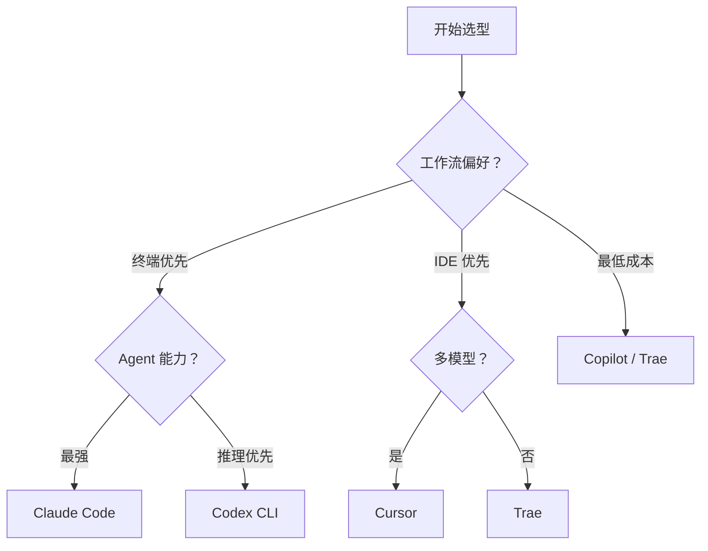

# AI Coding 工具全景

> **TL;DR**：5 大工具、3 种形态——CLI（Claude Code）、IDE（Cursor）、插件（Copilot）。选型看你的工作流偏好。

⏱ 预计阅读时间：6 分钟

## 你能在这里学到

- 5 大 AI Coding 工具的核心差异
- CLI vs IDE vs 插件三种形态的优劣
- 价格、能力、适用场景的横向对比
- 如何根据团队情况选型

## 5 大工具速查

| 工具 | 厂商 | 形态 | 定价 | 核心特色 |
|------|------|------|------|----------|
| **Claude Code** | Anthropic | CLI | $20-200/月 | Agent 能力最强、MCP 生态 |
| **Cursor** | Cursor Inc. | IDE | $20-40/月 | AI-native IDE、多模型支持 |
| **GitHub Copilot** | Microsoft/GitHub | 插件 | $10-39/月 | 生态最大、VS Code 集成最深 |
| **Codex CLI** | OpenAI | CLI | 按 token | 推理能力最强 |
| **Trae** | 字节跳动 | IDE | 免费 | 中文优化、免费 |

## 三种形态

### CLI 形态（Claude Code / Codex CLI）

**优势**：
- 终端原生，不离开命令行
- Agent 能力完整（文件、Shell、搜索、Web）
- 可脚本化、可 CI 集成
- 不依赖特定 IDE

**劣势**：
- 没有 GUI 预览
- 学习曲线较高
- 需要熟悉终端操作

### IDE 形态（Cursor / Trae）

**优势**：
- 完整 IDE 体验（调试、Git、插件）
- 代码预览、diff 可视化
- 学习曲线低

**劣势**：
- 绑定特定 IDE
- Agent 能力受限于 IDE 框架
- 不可脚本化

### 插件形态（Copilot）

**优势**：
- 集成到现有 IDE（VS Code / JetBrains）
- 最低学习成本
- 生态最大

**劣势**：
- Agent 能力最弱
- 依赖 IDE 版本
- 定制化有限

## 能力对比

| 能力 | Claude Code | Cursor | Copilot | Codex CLI | Trae |
|------|-------------|--------|---------|-----------|------|
| **代码补全** | ✅ | ✅ | ✅ | ✅ | ✅ |
| **对话式编程** | ✅ | ✅ | ✅ | ✅ | ✅ |
| **Agent 能力** | ⭐⭐⭐ | ⭐⭐ | ⭐ | ⭐⭐⭐ | ⭐⭐ |
| **MCP 生态** | ⭐⭐⭐ | ⭐⭐ | ⭐ | ⭐ | ⭐ |
| **多模型支持** | ⭐⭐ | ⭐⭐⭐ | ⭐⭐ | ⭐ | ⭐⭐ |
| **CI/CD 集成** | ⭐⭐⭐ | ⭐ | ⭐⭐ | ⭐⭐⭐ | ⭐ |
| **中文优化** | ⭐⭐ | ⭐⭐ | ⭐⭐ | ⭐⭐ | ⭐⭐⭐ |

## 价格对比

| 工具 | 免费版 | Pro | Team/Enterprise |
|------|--------|-----|-----------------|
| Claude Code | 有限额度 | $20/月 | $200/月 |
| Cursor | 有限额度 | $20/月 | $40/月 |
| Copilot | 公共仓库 | $10/月 | $39/月 |
| Codex CLI | 按 token | 按 token | 按 token |
| Trae | 免费 | — | — |

## 选型决策树

**经验法则**：

- **终端老手 + Agent 需求强** → Claude Code
- **IDE 用户 + 多模型需求** → Cursor
- **团队 + 最低成本** → Copilot
- **中文场景 + 预算有限** → Trae

## 常见坑

**工具不是万能**

AI Coding 工具是"辅助"，不是"替代"。核心设计、架构决策仍需人工。

**多工具混用**

团队内不同人用不同工具，可能导致代码风格不一致。建议统一。

## 参考

- [Claude Code 官方文档](https://code.claude.com/docs)
- [Cursor 官方文档](https://docs.cursor.com)
- [GitHub Copilot 文档](https://docs.github.com/copilot)
- [模型选型决策树](/reference/model-selection-guide)

## 下一步

- 深入 Claude Code → [Claude Code 深度评测](./claude-code)
- 深入 Cursor → [Cursor 深度评测](./cursor)
- 团队引入 → [团队 AI 工作流](../workflows/team)

## 如果你想

- 选模型 → [模型选型决策树](/reference/model-selection-guide)
- 看实战案例 → [Cookbook](/cookbook/)
