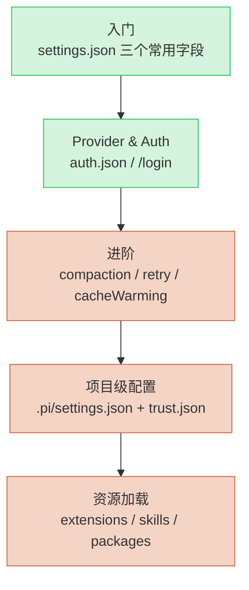

# Pi Coding Agent 总览

> **TL;DR**：Pi 是 Mario Zechner（libGDX 创始人）通过 earendil-works 组织发布的极简终端 Agent。`@earendil-works/pi-coding-agent` 这个 npm 包就是它的 CLI 产品形态，与 [pi.dev](https://pi.dev) 是同一个项目。

⏱ 预计阅读时间：5 分钟

## 你能在这里学到

- Pi 在工具谱系里的真实定位（CLI 产品，不是 pi-mono 单包）
- 配置在文件系统里的实际位置与两个 scope（全局 vs 项目）
- 与 [PI-agent 深度评测](../pi-agent) 的关系：评测视角 vs 配置视角
- 本专题的学习路径图

## 关键事实先说

读完下面三段，再决定要不要继续。

### 1. Pi = pi-mono = pi.dev = `@earendil-works/pi-coding-agent`

四件事是**同一个项目**，只是不同入口：

| 入口 | 角色 |
|------|------|
| `pi.dev` | 官网 + 文档站 |
| `pi-mono`（GitHub: `earendil-works/pi`） | monorepo 仓库 |
| `@earendil-works/pi-coding-agent`（npm） | 你 `npm install -g` 装的包 |
| `pi` 命令 | 上面那个包的 bin 入口 |

`earendil-works` 是 Mario 的发布组织（之前网名 `badlogic`）。`@earendil-works/pi-coding-agent` 是 pi-mono 仓库里 `packages/pi-coding-agent/` 这个子包的发布产物。

### 2. Pi 是 CLI 产品，不是纯框架

`pi-agent.md` 把 Pi 放在「框架」组，主要是从 **架构视角** 描述（5 阶段 Loop / 99.93% 缓存命中率 / 15+ 模型）。但你 `npm install` 完之后**直接能用**——这是 CLI 产品。

```bash
npm install -g @earendil-works/pi-coding-agent
pi
```

这一点和 Claude Code 完全同形态：装好就跑，不需要"组装"。

### 3. Pi 和 Claude Code 是同一物种

| 维度 | Pi | Claude Code |
|------|-----|------------|
| 形态 | CLI | CLI |
| 内置工具 | read / bash / edit / write / grep / find / ls | read / bash / edit / write / grep / glob / web |
| 扩展机制 | TypeScript Extensions + Skills + Prompt Templates + Themes | MCP + Skills + Slash Commands + Hooks |
| 配置目录 | `~/.pi/agent/` | `~/.claude/` |
| 项目配置 | `.pi/settings.json` | `.claude/settings.json` |
| 信任机制 | `~/.pi/agent/trust.json` + project trust prompt | workspace trust |
| 多 provider | 原生 15+ 模型 | 主要是 Anthropic |

**学 Pi 配置的过程 ≈ 学 Claude Code 配置的过程**——如果你已经熟 Claude Code，本专题可以快速扫读；如果是 Pi 新用户，按"入门 → 进阶"顺序读完即可。

## Pi 配置的两层目录

Pi 的配置 100% 在用户目录（项目级覆盖除外）：

```
~/.pi/                          # Pi 配置根
├── web-search.json             # web 搜索默认模型
├── context-mode/               # context-mode 状态
└── agent/                      # ⭐ 主配置目录
    ├── settings.json           # 主配置：provider / model / 主题 / 压缩 / 重试 / packages
    ├── models.json             # 自定义 provider / 模型声明
    ├── models-store.json       # 模型目录缓存（自动生成）
    ├── auth.json               # ⭐ 凭据（API key / OAuth token，敏感）
    ├── trust.json              # 项目信任列表
    ├── extensions/             # 本地扩展（TypeScript）
    ├── npm/                    # 用户级 npm 依赖
    ├── bin/                    # 内置 fd 等工具
    └── sessions/               # 会话记录
```

**项目级配置**只在项目根目录有 `.pi/settings.json` 时生效，用于团队共享设置。

## 学习路径图



- **绿色** = 入门必读（5 分钟）
- **橙色** = 进阶（按需）

## 章节地图

| 章节 | 内容 | 状态 |
|------|------|------|
| [配置文件详解（入门 → 进阶）](./configuration) | settings.json 全字段 + auth.json + trust.json + 项目级 | ✅ published |
| [进阶资源加载（扩展 / Skills / 包）](./resources) | extensions / skills / packages 三种机制 + 实战 + 选型决策 | ✅ published |
| [Pi + Jev + DeepSeek 实战（危险命令拦截）](./jev-harness) | 三层 guard-system：5 概念 + 4 阶段实战 + 4 维度验证 | ✅ published |
| （规划）Pi ↔ Claude Code 迁移指南 | settings 字段对照表 | planned |

## 与 PI-agent 深度评测的关系

| 文件 | 视角 | 内容 |
|------|------|------|
| [PI-agent 深度评测](../pi-agent) | **架构视角**（自上而下） | 5 阶段 Loop、99.93% 缓存、15+ 模型、AGENTS.md / SYSTEM.md 规则链 |
| 本专题 | **配置视角**（自下而上） | 配置文件在哪、怎么改、哪些字段控制什么 |

两份文档**互补不重复**。先读 PI-agent 评测了解"它是什么"，再读本专题的 configuration 学会"怎么调"。

## 参考

- [Pi 官方文档](https://pi.dev) — 入口站
- [Pi 设置文档（settings.md）](https://github.com/earendil-works/pi/blob/main/packages/coding-agent/docs/settings.md) — 本专题主要参考
- [Pi Provider 文档（providers.md）](https://github.com/earendil-works/pi/blob/main/packages/coding-agent/docs/providers.md) — auth 与多 provider
- [PI-agent 深度评测](../pi-agent) — 架构视角

## 下一步

- 立刻上手 → [配置文件详解（入门 → 进阶）](./configuration)
- 想理解架构 → [PI-agent 深度评测](../pi-agent)
- 横向对比 → [AI 工具全景](../overview)

## 如果你想

- 把 Pi 接进团队的 AI 流水线 → [团队 AI 工作流](/ai-harness/workflows/team)
- 给 Pi 写第一个 Skill → [写你的第一个 Skill](/cookbook/build-first-skill)（路径参考，待适配）
- 排查诡异行为 → 配置文件详解最后一节「常见坑」
