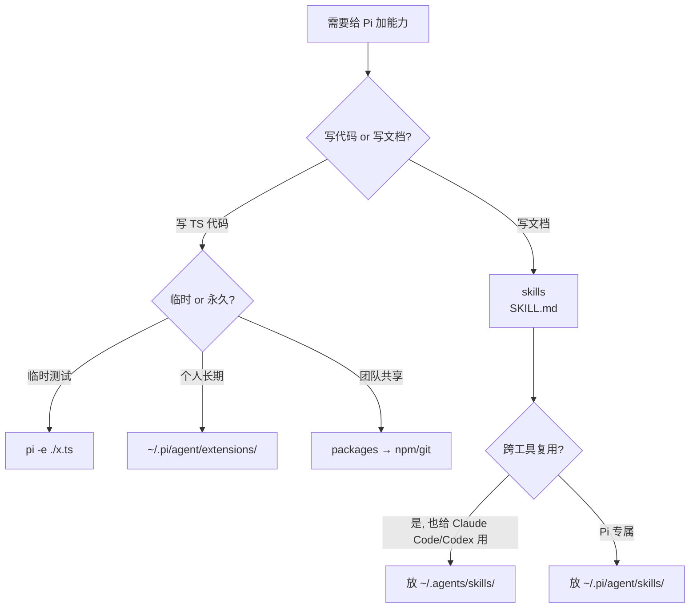

# Pi 进阶资源加载：扩展、Skills 与包实战

> **TL;DR**：Pi 把「如何加载额外能力」做成三种机制——**extensions**（命令式，TypeScript）、**skills**（声明式，SKILL.md）、**packages**（npm/git 分发载体）。本文讲清楚怎么选、怎么写、怎么调。

⏱ 预计阅读时间：15 分钟

## 你能在这里学到

- 三种机制的**本质区别**与选型决策树
- extensions：从单文件到多文件扩展，含真实例子（git-ai）
- skills：写可跨工具复用（Claude Code / Codex 都能读）的 SKILL.md
- packages：从 `pi install` 到自己写一个 npm 包发布
- 统一的安全模型与调试技巧

## 前置

- 读完 [Pi 配置文件详解（入门 → 进阶）](./configuration)，知道 `settings.json` 在哪
- 已至少装过 1 个包（`pi list` 能看到东西）
- 懂 TypeScript 基础（写 extensions 需要）

---

## 一、三种机制的本质区别

| 维度 | extensions | skills | packages |
|------|-----------|--------|----------|
| **形态** | TypeScript 模块 | 目录 + `SKILL.md` | npm/git 包（含上面两类） |
| **触发方式** | 加载即生效 | 模型按需 `/skill:name` 加载 | 加载其内 extensions + skills |
| **能做什么** | 自定义工具、拦截事件、改 system prompt、自定义命令、注册 provider | 注入提示词、附带脚本/资源、按需文档 | 上面任意组合 |
| **写起来** | 写 TypeScript | 写 Markdown | 写 `package.json` + 内容 |
| **改后生效** | `/reload` 即时 | 重启或 `/reload` | `pi install` 后重启 |
| **权限** | 全系统权限（任意代码） | 全系统权限（让模型做事） | 全系统权限（同 extensions） |

### 选型决策树



### 一句话选型

| 你的需求 | 选 |
|---------|-----|
| 拦截危险命令、记录审计日志、改 system prompt | **extensions** |
| 写一份"怎么处理 PDF"的工作流 | **skills** |
| 把团队的工作流分发给所有人 | **packages**（包内放 extensions + skills） |

---

## 二、Extensions：命令式自定义

### 何时用

- 需要**拦截**或**修改** Pi 内部行为（工具调用、provider 请求、context）
- 要给 LLM 加**新工具**（自定义 `greet`、`fetch_url`、`db_query`）
- 要加**自定义命令**（`/deploy`、`/checkpoint`）
- 想读/写 session 状态、UI、状态栏

### 加载位置

| 路径 | scope |
|------|-------|
| `~/.pi/agent/extensions/*.ts` | 全局 |
| `~/.pi/agent/extensions/*/index.ts` | 全局（多文件扩展的入口） |
| `.pi/extensions/*.ts` | 项目（需信任后生效） |
| `settings.json` 的 `extensions` 数组 | 任意路径 |

> 💡 **三种扩展风格**：
> 1. **单文件**（`.ts`）—— 小功能
> 2. **目录 + `index.ts`** —— 多文件
> 3. **带 `package.json`** —— 需要 npm 依赖

### 实战 1：最小可运行（自定义工具）

创建 `~/.pi/agent/extensions/hello.ts`：

```typescript
import type { ExtensionAPI } from "@earendil-works/pi-coding-agent";
import { Type } from "typebox";

export default function (pi: ExtensionAPI) {
  // 注册一个 LLM 可调用的工具
  pi.registerTool({
    name: "greet",
    label: "Greet",
    description: "用名字打招呼",
    parameters: Type.Object({
      name: Type.String({ description: "要打招呼的对象" }),
    }),
    async execute(_toolCallId, params, _signal, _onUpdate, _ctx) {
      return {
        content: [{ type: "text", text: `你好，${params.name}！` }],
        details: {},
      };
    },
  });
}
```

测试：

```bash
pi -e ~/.pi/agent/extensions/hello.ts
# 然后让 Pi 调用 greet 工具
```

> 🔑 **TypeBox 不是 Zod**——Pi 用 `@sinclair/typebox` 定义 schema，验证和 JSON schema 兼容。

### 实战 2：拦截工具调用

最常见的扩展用途。示例：拦截 `rm -rf`，需要确认。

```typescript
import type { ExtensionAPI } from "@earendil-works/pi-coding-agent";
import { isToolCallEventType } from "@earendil-works/pi-coding-agent";

export default function (pi: ExtensionAPI) {
  pi.on("tool_call", async (event, ctx) => {
    if (isToolCallEventType("bash", event)) {
      if (event.input.command?.includes("rm -rf")) {
        const ok = await ctx.ui.confirm("危险命令", `允许执行吗？\n\n${event.input.command}`);
        if (!ok) {
          return { block: true, reason: "用户拒绝", terminate: true };
        }
      }
    }
  });
}
```

**关键点**：

- `isToolCallEventType("bash", event)` → `event.input` 自动类型化为 `{ command: string; timeout?: number }`
- 返回 `{ block: true, reason }` 阻止执行
- `terminate: true` 让 batch 中其他工具也停止
- `event.input` 是**可变**的——可以就地改写参数

### 实战 3：自定义命令 + 快捷键

```typescript
import type { ExtensionAPI } from "@earendil-works/pi-coding-agent";

export default function (pi: ExtensionAPI) {
  pi.registerCommand("checkpoint", {
    description: "在 git 上打个 checkpoint",
    handler: async (args, ctx) => {
      const { execSync } = await import("node:child_process");
      const sha = execSync("git rev-parse HEAD", { cwd: ctx.cwd, encoding: "utf-8" }).trim();
      ctx.ui.notify(`📌 Checkpoint: ${sha.slice(0, 7)}`, "info");
    },
  });

  pi.registerShortcut("ctrl+shift+s", {
    description: "保存 checkpoint",
    handler: async (ctx) => {
      // 复用上面命令
      await pi.sendUserMessage("/checkpoint");
    },
  });

  pi.registerFlag("verbose", {
    description: "开启详细日志",
    type: "boolean",
    default: false,
  });
}
```

### 实战 4：跨多个事件做完整工作流

```typescript
pi.on("session_start", async (event, ctx) => {
  ctx.ui.notify(`Session 启动 (${event.reason})`, "info");
  ctx.ui.setStatus("my-ext", "✅ 已加载");
});

pi.on("before_agent_start", async (event, ctx) => {
  // 注入额外系统提示
  return {
    systemPrompt: event.systemPrompt + "\n\n额外规则...",
  };
});

pi.on("message_end", async (event, ctx) => {
  // 改最终消息（比如追加 token 用量统计）
  if (event.message.role === "assistant" && event.message.usage) {
    return {
      message: {
        ...event.message,
        usage: {
          ...event.message.usage,
          cost: { ...event.message.usage.cost, total: 0 },
        },
      },
    };
  }
});

pi.on("session_shutdown", async (_event, _ctx) => {
  // 清理资源（关闭文件句柄、socket）
});
```

### 真实例子：你系统上的 `git-ai.ts`

```bash
# 你装的位置
ls -la ~/.pi/agent/extensions/
# - git-ai.ts            (单文件扩展，381 行)
# - deepseek-cache/      (目录扩展，含 history/stats/summary-cache.json)
```

`git-ai.ts` 是个**单文件扩展**，订阅了两个事件：

```typescript
// 简化示意
pi.on("tool_call", async (event, ctx) => {
  // 拦截 edit/write/bash 工具
  // 调用 git-ai 二进制记录 AI 编辑
});

pi.on("tool_result", async (event, ctx) => {
  // 把编辑结果传给 git-ai
});
```

`deepseek-cache/` 是个**目录扩展**——`index.ts` + 多个 JSON 数据文件。这是 skills 做不到的（skills 是声明式）。

### 调试技巧

| 你想做的 | 怎么做 |
|---------|--------|
| 不重启试一个扩展 | `pi -e ./test.ts`（临时加载） |
| 改完后立即生效 | 在 Pi 里 `/reload` |
| 看加载了哪些扩展 | 启动时看 banner，或 `pi --help` 不显示，但读源码可见 |
| 改 system prompt 的 hook | 配合 `ctx.getSystemPrompt()` 打印当前长度 |
| 异步 provider 注册 | 用 `async (pi) => {...}` 工厂函数（pi 会 await） |
| 避免工厂里启动后台资源 | 改用 `session_start` 事件，配套 `session_shutdown` 清理 |

---

## 三、Skills：声明式能力包

### 何时用

- 写一份「**怎么处理 X**」的工作流（PDF 处理、代码 review、数据清洗）
- 想给模型**按需**加载详细文档（不污染 system prompt）
- 想让 Claude Code / Codex 也能读同一份（**Agent Skills 标准**）

### 与 extensions 的根本区别

| 维度 | extensions | skills |
|------|-----------|--------|
| 加载方式 | 启动时全部加载 | 按需加载（description 匹配才加载 SKILL.md） |
| 写什么 | TypeScript 代码 | Markdown + 可选脚本 |
| 能拦截事件吗 | ✅ 完整 hook 体系 | ❌ 只能让 LLM 按文档做 |
| 能改 system prompt 吗 | ✅ 通过 hook | ❌ description 进系统提示，正文按需读 |
| 跨工具兼容 | ❌ Pi 专属 | ✅ Agent Skills 标准（Claude Code / Codex / Cursor / Trae 都读） |

### 加载位置

| 路径 | scope | 备注 |
|------|-------|------|
| `~/.pi/agent/skills/` | 全局 | 根目录 `.md` 文件也可作 skill |
| `~/.agents/skills/` | 全局 | 与 Claude Code 共享。**根目录 `.md` 忽略**（只识别嵌套目录的 SKILL.md） |
| `.pi/skills/` | 项目 | 需信任 |
| `.agents/skills/` | 项目 | 同上，向父目录走（git repo 根） |
| packages 内的 `skills/` | 包 | 通过 `pi install` 装载 |
| `settings.json` 的 `skills` 数组 | 任意 | 支持 glob |

### SKILL.md 写法

```markdown
---
name: pdf-processing
description: 从 PDF 文件提取文本、合并 PDF、填充表单。处理 PDF 文档时使用。
license: MIT
compatibility: 需要 pdftotext (brew install poppler)
---

# PDF 处理

## 提取文本

\`\`\`bash
pdftotext input.pdf output.txt
\`\`\`

## 合并 PDF

\`\`\`bash
pdftotext -layout file1.pdf file2.pdf combined.txt
\`\`\`

## 参考

- [poppler 文档](references/poppler.md)
```

**关键字段**（frontmatter）：

| 字段 | 必填 | 规则 |
|------|------|------|
| `name` | ✅ | 1-64 字符，小写字母+数字+短横线，**不要求和目录同名** |
| `description` | ✅ | 1-1024 字符。**决定 skill 何时加载**——要写具体 |
| `license` | ❌ | 协议名 |
| `compatibility` | ❌ | 环境要求（≤500 字） |
| `metadata` | ❌ | 任意 key-value |
| `allowed-tools` | ❌ | 空格分隔的预批准工具（实验性） |
| `disable-model-invocation` | ❌ | `true` 后只可通过 `/skill:name` 调用 |

**目录结构**（自由发挥）：

```
my-skill/
├── SKILL.md              # 必填
├── scripts/              # 辅助脚本
│   └── process.sh
├── references/           # 按需加载的详细文档
│   └── api-reference.md
└── assets/
    └── template.json
```

### 实战：跨工具复用

**Pi、Claude Code、Codex 都认 Agent Skills 标准**——你写一份 skill，三个工具都能用：

```bash
# 全局共享 skill（Pi + Claude Code + Codex 都读）
~/.agents/skills/
└── code-review/
    └── SKILL.md

# 项目级（团队成员都用）
your-repo/
└── .agents/
    └── skills/
        └── api-design/
            └── SKILL.md
```

**配置 Pi 让它读 Claude Code 的 skills 目录**：

```json
// ~/.pi/agent/settings.json
{
  "skills": [
    "~/.claude/skills",
    "~/.codex/skills",
    "~/.agents/skills"
  ]
}
```

> 💡 **共享 skill 目录的好处**：换工具零成本。团队里有人用 Claude Code、有人用 Pi、有人用 Codex，都能用同一份 review / docs / oncall 工作流。

### 强制加载某个 skill

Pi 默认让 LLM 按 description 匹配。**但模型不一定每次都主动读**——想强制时：

```bash
# 命令式（用户显式触发）
/skill:code-review
/skill:pdf-tools extract
```

或者在 system prompt / SYSTEM.md 里写：

```markdown
每次用户发 PR 前，请 /skill:code-review 走一遍检查清单
```

`enableSkillCommands: false` 可关掉 `/skill:` 命令（仍可走自动匹配）。

---

## 四、Packages：分发载体

### 何时用

- 团队共享 extensions + skills + prompts + themes
- 想把配置 publish 到 npm/git（团队成员 `pi install` 一次到位）
- 个人想把同一套工作流在多台机器同步（git 仓库就是包）

### 三种来源

| 来源 | 写法 | 装到哪里 |
|------|------|---------|
| npm | `npm:@scope/pkg@1.0.0` | `~/.pi/agent/npm/` 或 `.pi/npm/` |
| git | `git:github.com/user/repo@v1` 或 `https://...` | `~/.pi/agent/git/<host>/<path>` |
| local | `/abs/path` 或 `./relative/path` | 不复制，加到 settings |

### 装、卸、查、更新

```bash
# 装
pi install npm:pi-web-access
pi install git:github.com/badlogic/pi-skills@v1
pi install ./local-package

# 临时试（不写 settings，仅当前 run）
pi -e npm:foo/bar

# 卸
pi remove npm:pi-web-access

# 查
pi list                    # 列出当前 settings 里的 packages
pi update                  # 更新 pi CLI
pi update --all             # 更新 pi + 所有 packages
pi update --extensions     # 只更新 packages
pi update npm:pi-web-access  # 只更新一个包
```

**项目级**安装（写到 `.pi/settings.json`，团队共享）：

```bash
pi install -l npm:team-workflow
```

**自动安装**：项目启动时，如果 `.pi/settings.json` 里有 packages 但用户没装，Pi 在信任项目后**自动 `npm install`**。

### 实战 1：你正在用的 4 个包

```bash
# 查看你装的
cat ~/.pi/agent/npm/package.json
```

```json
{
  "name": "pi-extensions",
  "private": true,
  "dependencies": {
    "context-mode": "^1.0.111",
    "pi-deepseek-cache": "^0.1.0",
    "pi-subagents": "^0.27.0",
    "pi-web-access": "^0.10.7"
  }
}
```

对应的 `settings.json`：

```json
{
  "packages": [
    "npm:pi-web-access",
    "npm:pi-subagents",
    "npm:pi-deepseek-cache",
    "npm:context-mode"
  ]
}
```

> 💡 **`pi-extensions` 是 npm hoist 容器**——你 `pi install` 的 npm 包全部进这里，共享 `node_modules`，避免重复依赖。

### 实战 2：写一个自己的 package 并发布

最简结构（无 npm 依赖）：

```markdown
my-team-package/
├── package.json          # 必填（pi 清单）
├── extensions/
│   └── team-tool.ts      # TypeScript 扩展
├── skills/
│   └── code-review/      # Skill 目录
│       └── SKILL.md
├── prompts/
│   └── pr-description.md # 提示模板
└── themes/
    └── team-dark.json    # 主题
```

**`package.json`**（关键）：

```json
{
  "name": "@yourorg/pi-team",
  "version": "0.1.0",
  "description": "团队 Pi 工作流包",
  "keywords": ["pi-package"],
  "pi": {
    "extensions": ["./extensions"],
    "skills": ["./skills"],
    "prompts": ["./prompts"],
    "themes": ["./themes"]
  }
}
```

**或者用约定目录**（无需 `pi` 字段）——Pi 自动识别 `extensions/`、`skills/`、`prompts/`、`themes/`。

发布到 npm：

```bash
npm login
npm publish --access public
```

团队使用：

```bash
pi install npm:@yourorg/pi-team
```

### 实战 3：包带第三方依赖

如果你的扩展需要 `zod` / `chalk`：

```json
{
  "name": "@yourorg/pi-team",
  "dependencies": {
    "zod": "^3.0.0",
    "chalk": "^5.0.0"
  },
  "pi": {
    "extensions": ["./extensions"]
  }
}
```

`pi install` 时自动跑 `npm install` 把依赖装上。

> ⚠️ **Pi 核心包必须用 `peerDependencies`**：`@earendil-works/pi-ai`、`@earendil-works/pi-agent-core`、`@earendil-works/pi-coding-agent`、`@earendil-works/pi-tui`、`typebox`——Pi 已自带，别重复打包。

### 实战 4：filter——只加载包里的部分资源

```json
{
  "packages": [
    "npm:simple-pkg",
    {
      "source": "npm:big-pkg",
      "extensions": ["extensions/*.ts", "!extensions/legacy.ts"],
      "skills": ["code-review", "security-audit"],
      "prompts": ["prompts/pr.md"],
      "themes": ["+themes/legacy.json"]
    }
  ]
}
```

- 字符串形式加载包内所有该类型资源
- 对象形式只加载指定路径
- `!pattern` 排除，`+path` / `-path` 强制包含/排除精确路径
- **`[]` 是"该类型一个都不加载"**

### 实战 5：项目级 package（团队协作）

```
your-repo/
├── AGENTS.md             # 跨工具规范
├── .pi/
│   └── settings.json     # 项目级 Pi 配置（含 packages）
└── src/...
```

`.pi/settings.json`：

```json
{
  "packages": [
    "npm:@yourorg/pi-team@1.2.0",
    "git:github.com/yourorg/pi-oncall@v3"
  ],
  "compaction": { "reserveTokens": 8192 }
}
```

**新人 clone 仓库后**：

```bash
cd your-repo
pi                # 首次启动：trust 提示 → yes → 自动 npm install packages
```

### `pi config`：可视化管理

```bash
pi config         # 进入交互式配置（默认改 ~/.pi/agent/settings.json）
pi config -l      # 进入项目级 .pi/settings.json
```

里面能勾选启用/禁用 extensions / skills / prompts / themes，看到继承关系（项目级高亮）。

---

## 五、统一的安全模型

**所有三种机制都跑在你的系统权限下**——没有沙箱、没有权限提示、没有白名单。

| 风险 | 来自 | 防御 |
|------|------|------|
| 任意代码执行 | extensions / packages 内的 TS | **只装信任源** + 读源码 |
| 任意命令执行 | skills 让 LLM 调 bash | **review skill 内容** + 别把陌生 skill 加进 `~/.agents/skills/` |
| 任意 skill 加载 | `.agents/skills/` 全局共享 | **不把 `~/.claude/skills/` 直接链进 Pi settings**——先审计 |
| 项目级恶意配置 | 信任的 `.pi/settings.json` + `.pi/extensions/` | **陌生仓库先 `ls .pi/` 看有什么**，再决定 trust |

> 🛑 **Pi 的信任 prompt 是真的在保护你**——看到 `Trust this project?` 别无脑 y，除非你 review 过 `.pi/` 目录。

---

## 六、调试与排错

### `/reload`：重载所有资源

```bash
/reload
```

重新加载 extensions + skills + prompts + themes。**改完 `.ts` 后立即生效**。

### 临时测试：`pi -e`

```bash
pi -e ./draft.ts
```

只对当前 run 加载 `./draft.ts`，不写到 settings。**适合调试**——改完再正式装。

### 看加载顺序

启动 banner 显示加载了哪些包。要看每个扩展的加载细节，**自己加 `console.log`**：

```typescript
export default function (pi: ExtensionAPI) {
  console.log("[my-ext] loaded");
  pi.on("session_start", () => console.log("[my-ext] session start"));
}
```

### 异步工厂要 await

如果你的扩展在工厂里跑 `fetch`，**用 `async` 函数**——Pi 会 await：

```typescript
export default async function (pi: ExtensionAPI) {
  const res = await fetch("http://localhost:1234/v1/models");
  const data = await res.json();
  pi.registerProvider("local", { /* ... */ });
}
```

> ⚠️ **不要在工厂里启动后台进程、socket、timer**——这些应该放进 `session_start` 事件，并在 `session_shutdown` 里清理。

### 调系统 prompt：`ctx.getSystemPrompt()`

```typescript
pi.on("before_agent_start", (event, ctx) => {
  console.log(`system prompt length: ${ctx.getSystemPrompt().length}`);
});
```

### 拦截 provider 请求：`before_provider_request`

```typescript
pi.on("before_provider_request", (event, ctx) => {
  console.log(JSON.stringify(event.payload, null, 2));
  // return { ...event.payload, temperature: 0 };  // 改 payload
});
```

调试 provider 序列化和缓存命中时很有用。

---

## 七、常见坑

**坑 1：`~/.agents/skills/` 根目录 `.md` 不识别**

这是**有意为之**——根目录 `.md` 当 README，不当 skill。skill 必须在子目录里含 `SKILL.md`。

**坑 2：`/skill:` 命令没生效**

`enableSkillCommands` 默认 `true`，但可以关。检查 `settings.json`：

```json
{ "enableSkillCommands": true }
```

**坑 3：Skill 不被自动加载**

模型不一定每次主动读 SKILL.md。**description 写具体**——「处理 PDF 时用」比「PDF 工具」好。

**坑 4：包更新了 settings 没更新**

`Pi update` 只更新**已 pinned 的 ref**。如果你 `pi install git:github.com/u/r@v1`，要换 `@v2` 必须重新 `pi install git:github.com/u/r@v2`。

**坑 5：项目级 packages 不自动装**

要项目被**信任**后才会自动 `npm install`。非交互模式走 `defaultProjectTrust` 字段。

**坑 6：扩展 factory 里启动后台进程导致幽灵进程**

放 `session_start` 里，配套 `session_shutdown` 清理。详见 extensions.md 的「Long-lived resources」。

**坑 7：扩展改 system prompt 不生效**

`before_agent_start` 的 `systemPrompt` 是**链式覆盖**——多个扩展都改时后注册的赢。要可靠地用 `systemPromptOptions.sections`。

**坑 8：typebox schema 写错，工具不可用**

`parameters` 必须是 `Type.Object(...)`，**字段必须是 `Type.Xxx(...)` 包装**——不是裸字符串。

```typescript
// ❌ 错
parameters: { name: "string" }

// ✅ 对
parameters: Type.Object({ name: Type.String() })
```

**坑 9：git URL 加 `git:` 前缀 vs 不加**

- 加 `git:`：`git:github.com/user/repo`（简写）
- 不加：必须是完整 URL（`https://...` 或 `ssh://...`）

**坑 10：自定义命令和内置冲突**

`pi.registerCommand("model", ...)` 会**覆盖**内置的 `/model`。起名时查 `/` 命令列表。

---

## 速查卡片

```bash
# 临时试一个扩展
pi -e ./draft.ts

# 装 / 卸 / 查
pi install npm:foo
pi remove npm:foo
pi list

# 重载（改 .ts 后）
/reload

# 跨工具 skill 共享
~/.agents/skills/   # Pi + Claude Code + Codex 都读

# 项目级共享（团队）
.pi/settings.json   # packages 数组
```

---

## 参考

- [Pi 扩展文档（extensions.md）](https://github.com/earendil-works/pi/blob/main/packages/coding-agent/docs/extensions.md) — 完整 API 参考
- [Pi Skills 文档（skills.md）](https://github.com/earendil-works/pi/blob/main/packages/coding-agent/docs/skills.md) — Agent Skills 标准兼容
- [Pi Packages 文档（packages.md）](https://github.com/earendil-works/pi/blob/main/packages/coding-agent/docs/packages.md) — npm/git 分发
- [Pi 配置文件详解（入门 → 进阶）](./configuration) — 字段与 packages 的关系
- [PI-agent 深度评测](../pi-agent) — 架构视角
- [Agent Skills 标准规范](https://agentskills.io/specification) — skill 跨工具的标准

## 下一步

- 想从零写一个自己的扩展 → [Pi 扩展文档](https://github.com/earendil-works/pi/blob/main/packages/coding-agent/docs/extensions.md)
- 想给团队做一份共享 skill → [Pi Skills 文档](https://github.com/earendil-works/pi/blob/main/packages/coding-agent/docs/skills.md)
- 想理解 settings 字段 → [Pi 配置文件详解（入门 → 进阶）](./configuration)

## 如果你想

- 把 Pi 和 Claude Code 工具链打通 → 共享 `~/.agents/skills/`
- 给团队 npm 发一个 Pi 工作流包 → [Pi Packages 文档](https://github.com/earendil-works/pi/blob/main/packages/coding-agent/docs/packages.md)
- 排查诡异的扩展行为 → 翻回「六、调试与排错」