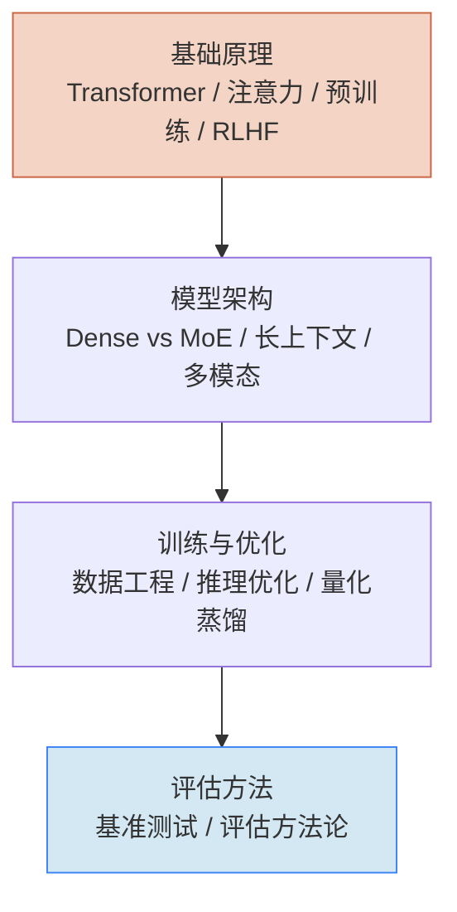

# AI 核心技术

> 理解 AI 的底层逻辑——不只是会用，还要知道为什么能用。

## 谁应该读这一章

- 想理解大模型原理的开发者
- 需要选型（Dense vs MoE、长上下文方案）的技术决策者
- 对 AI 训练流程好奇的从业者

如果你只想用 AI 工具，[AI Coding 落地](/ai-coding/) 更适合你。

## 章节地图

## 分组概览

**基础原理** — Transformer 架构、注意力机制、预训练与微调、RLHF 与对齐  
**模型架构** — Dense vs MoE 路由、长上下文实现、多模态架构  
**训练与优化** — 数据工程、推理优化、量化与蒸馏  
**评估方法** — 基准测试体系、评估方法论

## 下一步

- 从原理开始 → [Transformer 架构](/ai-core/fundamentals/transformer)
- 直接看对比 → [LLM 全景](/llm-landscape/)
- 动手实操 → [AI Coding 落地](/ai-coding/)

## 如果你想

- 选模型 → [LLM 全景 · 选型决策树](/llm-landscape/selection-guide)
- 看产品动态 → [AI 产品动向](/ai-trends/)
