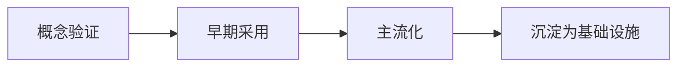

# 行业趋势

> **TL;DR**：趋势判断的核心不是预测，是「分清信号与噪音」。本文给分析方法论 + 当前可确认的趋势信号清单。

⏱ 预计阅读时间：6 分钟

## 你能在这里学到

- 信号与噪音的区分方法
- 趋势生命周期的四个阶段
- 当前可确认的趋势信号（截至 2026-08）

## 一、信号 vs 噪音

**噪音**：单次发布、单个产品功能、单条融资新闻——今天爆、下周没人提。

**信号**：被多方独立验证的方向，且持续半年以上：

- 多个大厂同时投入（不是一家独发）
- 成本 / 效果数据持续改善（不是一次性 demo）
- 开发者生态形成（工具、教程、招聘出现）

> **判断工具**：问「这个方向一年后还在不在」。还在 → 值得投入时间；不确定 → 等第二次验证。

## 二、趋势生命周期

| 阶段 | 特征 | 该做什么 |
| --- | --- | --- |
| 概念验证 | demo 惊艳，工具缺失 | 观察，别重仓 |
| 早期采用 | 开发者涌入，工具出现 | 可以试水 |
| 主流化 | 企业采购，岗位出现 | 值得投入 |
| 基础设施 | 变成默认选项 | 只需跟进 |

## 三、当前可确认的趋势信号（截至 2026-08）

| 趋势 | 证据 | 阶段 |
| --- | --- | --- |
| Agent 从 demo 到生产 | 各家 Agent 工具链成熟，企业落地案例增多 | 早期采用 → 主流化 |
| MCP 协议标准化 | 开放协议，主流工具接入 | 早期采用 |
| 推理成本持续下降 | 开源模型追平闭源，API 降价 | 主流化 |
| 多模态成为默认 | 主要模型均原生支持 | 主流化 |
| 对齐与安全治理 | 各国监管推进，企业预算增加 | 早期采用 |

> 信号会随季度更新；判断依据以文末来源为准。与本站各模块的对应：[Agent 实践](/ai-coding/)、[MCP](/claude-code/mcp/what-is-mcp)。

## 四、避免追热点的 3 条纪律

1. **不因单次 demo 改变技术选型**——等第二次独立验证
2. **不因融资新闻判断技术路线**——钱多不等于路线对
3. **每季度复盘一次**——把「三个月前我以为的」和「实际发生的」对照

## 参考

- [Model Context Protocol 官网](https://modelcontextprotocol.io)（访问于 2026-08-14）
- [Stanford AI Index](https://aiindex.stanford.edu)（访问于 2026-08-14）

## 下一步

- 看具体厂商动态 → [月度产品速报](/ai-trends/product-updates/monthly)
- 看资本信号 → [投融资动态](/ai-trends/industry/funding)

## 如果你想

- 落地 Agent 工作流 → [AI Coding 落地](/ai-coding/)
- 理解 MCP → [MCP 是什么](/claude-code/mcp/what-is-mcp)
- 评估技术风险 → [AI 核心技术](/ai-core/)
