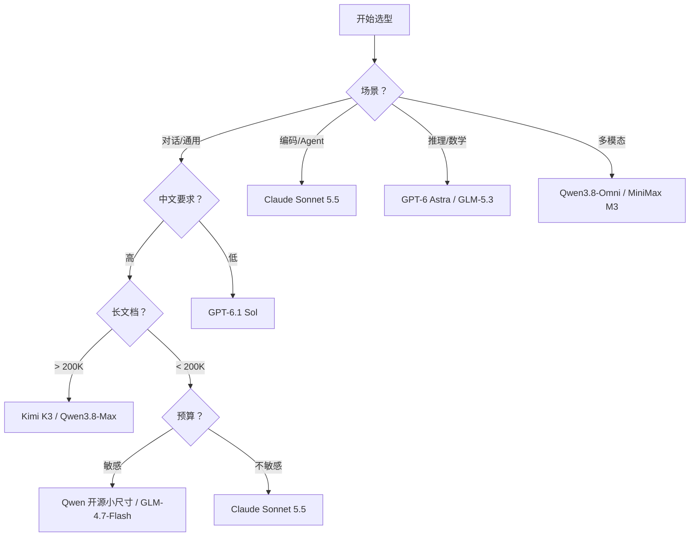

# 选型决策树

> **6 个维度、5 个决策点、1 张速查表**——看完就能选型，避开"过度选型"和"配置浪费"。

## 决策树：按 6 维度选



> ⚠️ **2026-09 换代提示**：OpenAI 主线已从 GPT-5.6 切到 GPT-6（推理靠 `effort` 档位，o 系列已让位）；**Kimi K2.5 / K2 全系已下线**（2026-08 起调用返回 404）；MiniMax 主力是 `M3`。详细换代与下线清单见 [7 厂商横向对比](./model-comparison)。

### 维度 1：场景

| 场景 | 首选 | 理由 |
|------|------|------|
| 通用对话 | Claude Sonnet 5.5 / GPT-6.1 Sol | 性价比高，中英文都好 |
| 编码 + Agent | Claude Sonnet 5.5 | Tool Use + Agent 最完整 |
| 数学/代码推理 | GPT-6 Astra（`effort` 档）/ GLM-5.3 | 推理时计算；GLM-5.3 思考常开不可关 |
| 长文档分析 | Kimi K3 / Qwen3.8-Max | 1M 上下文 |
| 多模态 | Qwen3.8-Omni / MiniMax `M3` | 全模态最完整 |

### 维度 2：中文要求

| 要求 | 首选 | 理由 |
|------|------|------|
| 高（中文原生） | Kimi / Qwen / GLM | 中文基准领先，中文文件解析原生 |
| 中（中英文均衡） | Claude Sonnet 5.5 | 中英文都好，Agent 最强 |
| 低（英文为主） | GPT-6.1 Sol / Claude Opus 5.5 | 英文基准最高 |

### 维度 3：长文档

| 长度 | 首选 | 理由 |
|------|------|------|
| < 200K | 任意旗舰模型 | 都够用 |
| 200K - 1M | Claude Fable 5.1 / Kimi K3 / Qwen3.8-Max | 1M 上下文 |
| > 1M | 暂无（主流旗舰封顶约 1M） | K3 / Fable 5.1 / Qwen3.8-Max 均约 1M，GPT-6 Astra 为 1,050,000 |

### 维度 4：编码能力

| 需求 | 首选 | 备注 |
|------|------|------|
| 最强编码 | Claude Opus 5.5 / Sonnet 5.5 | 官方 benchmark 见 Anthropic 发布博客 |
| 编码 + 推理 | Claude Opus 5.5 | 新一代思考不可关闭，深度由 `effort` 控制 |
| 开源编码 | Qwen 开源系列 / GLM-4 起全尺寸 | Apache 2.0，自部署成本可控 |

### 维度 5：预算

| 预算 | 首选 | 备注 |
|------|------|------|
| 极低 | MiniMax `M3` / GLM-4.7-Flash | `M3` $0.30/MTok input；GLM-4.7-Flash 免费 |
| 低 | GPT-6 Luna（$0.10/MTok）/ Qwen 开源自部署 | 开源自部署免费 |
| 中 | Claude Sonnet 5.5 / GPT-6.1 Sol / Grok 4.7 | $2/MTok input |
| 高 | Claude Opus 5.5 | $4/MTok input |
| 顶 | Claude Fable 5.1 / GPT-6 Astra | $10/MTok input，全系最贵 |

> ⚠️ **币种**：Moonshot（Kimi）、Zhipu（GLM）、Qwen 官方定价为**人民币**，其余为美元，跨厂商比价先统一币种。完整价格见 [7 厂商横向对比](./model-comparison) 第四节。

### 维度 6：部署

| 部署 | 首选 | 理由 |
|------|------|------|
| API 直调 | 任意厂商 | 都支持 |
| 海外企业私有 | Claude (Bedrock/Vertex) / GPT (Azure / Bedrock) | 云厂商集成 |
| 国内企业私有 | Qwen (阿里云) / GLM (智谱云) | 国产化 + 私有化 |
| 端侧/本地 | Qwen 开源小尺寸 / GLM 开源权重 | 全尺寸开源 + 端侧优化 |

## 5 个常见决策点

### 1. "私有化部署 AI 助手选谁"

**需求**：中文 + 私有化 + 成本可控

**推荐**：Qwen 开源（阿里云部署）或 GLM-5（智谱 MaaS / 开源权重）

**理由**：全尺寸开源 + 国产化合规 + 成本低（见各官方定价）

### 2. "个人 Claude Code 替代品"

**需求**：编码 + 工具调用 + 低成本

**推荐**：Claude Sonnet 5.5（$2/MTok）或 Qwen 开源（自部署）

**理由**：Claude Agent 最完整，Qwen 开源免费

### 3. "长 PDF / 合同分析"

**需求**：长上下文 + 文件解析 + 中文

**推荐**：Kimi K3（1M 上下文 + 文件解析）或 Qwen3.8-Max（1M 上下文）

**理由**：Kimi 文件解析原生支持，Qwen 价格更低

### 4. "数学 / 物理 / 算法竞赛"

**需求**：推理能力最强

**推荐**：GPT-6 Astra（`effort` 调至 max）或 GLM-5.3（中文推理，思考常开）

**理由**：推理时计算，"想得更久 = 答得更准"；o 系列是历史标杆但已让位 GPT-6

### 5. "国内业务 + 数据合规"

**需求**：国产化 + 私有化 + 数据不出境

**推荐**：Qwen（阿里云）或 GLM（智谱云）

**理由**：全尺寸开源 + 国内云厂商集成 + 数据合规

## 反向决策：哪些场景不该用 LLM

| 场景 | 问题 | 替代方案 |
|------|------|----------|
| 实时交易决策 | 延迟太高（100ms+） | 规则引擎 / 传统 ML |
| 精确数值计算 | 浮点误差 / 幻觉 | 计算器 / Wolfram Alpha |
| 法律/医疗诊断 | 责任归属不清 | 人工审核 + LLM 辅助 |
| 超大规模数据处理 | 成本太高 | 传统 ETL / Spark |

## 组合策略：Multi-model 路由

**思路**：便宜的模型处理简单任务，贵的模型处理复杂任务。

**示例路由**：

```
用户请求 → 简单分类？ → Qwen 开源（自部署，免费）
         → 需要推理？ → Claude Opus 5.5（$4/MTok）
         → 长文档？  → Kimi K3（¥20/MTok 输入，人民币）
```

**收益**：平均成本降低 60-80%，同时保持质量。

## 参考

- [7 厂商横向对比](./model-comparison) — 8 维度量化对比
- [跨厂商架构路线](/ai-core/model-arch/architecture-landscape) — 4 大技术路线详解
- [7 厂商详情](/ai-trends/vendors/) · [Anthropic](/ai-trends/vendors/anthropic/) · [OpenAI](/ai-trends/vendors/openai/) · [xAI](/ai-trends/vendors/grok/) · [Moonshot](/ai-trends/cn-vendors/moonshot/) · [MiniMax](/ai-trends/cn-vendors/minimax/) · [Zhipu](/ai-trends/cn-vendors/zhipu/) · [Qwen](/ai-trends/cn-vendors/qwen/)

## 下一步

- 选完型想接 SDK → [Claude Code SDK](/claude-capabilities/sdk/claude-code-sdk)
- 看部署案例 → [Cookbook](/cookbook/)
- 深入某家厂商 → [Anthropic](/ai-trends/vendors/anthropic/) / [OpenAI](/ai-trends/vendors/openai/) / [xAI](/ai-trends/vendors/grok/) / [Moonshot](/ai-trends/cn-vendors/moonshot/) / [MiniMax](/ai-trends/cn-vendors/minimax/) / [Zhipu](/ai-trends/cn-vendors/zhipu/) / [Qwen](/ai-trends/cn-vendors/qwen/)

## 如果你想

- 看量化对比数据 → [7 厂商横向对比](./model-comparison)
- 看技术路线差异 → [跨厂商架构路线](/ai-core/model-arch/architecture-landscape)
- 看某家厂商的完整档案与 2026-09 动态 → [国内厂商](/ai-trends/cn-vendors/) / [国外厂商](/ai-trends/vendors/)
