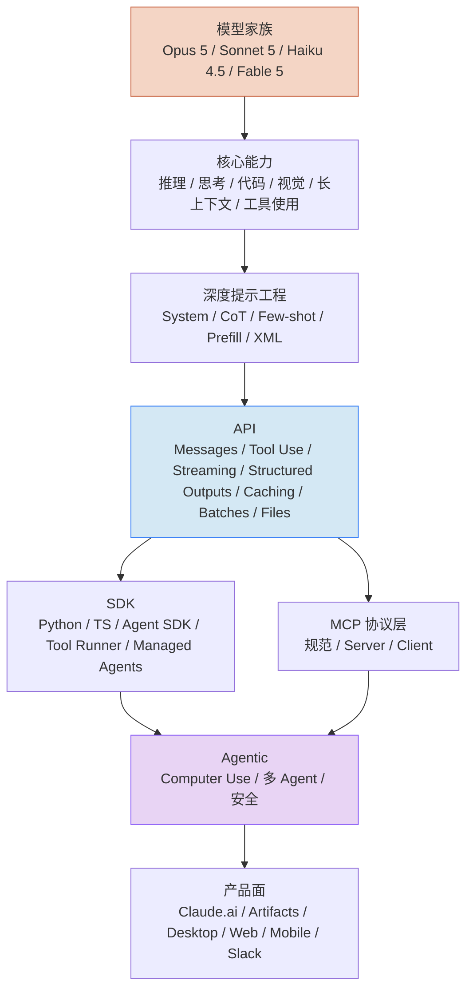

# Claude 能力

> 视角切换：这里不讲 CLI，讲 **Claude 本身**——模型、API、SDK、协议、产品面。

## 谁应该读这一章

- 已经会用 Claude Code，想构建自己的 AI 应用
- 想选型：该用哪个模型、走 API 还是 SDK、要不要用 Batch / Caching
- 想理解 Claude Code 底层依赖了什么

如果你只想用 CLI，[Claude Code 章](/claude-code/) 已经足够。

## 章节地图

## 分组概览

**模型家族** — 四条产品线（Opus 5 / Sonnet 5 / Haiku 4.5 / Fable 5）的定位、能力上限与选型建议  
**核心能力** — 推理、Extended Thinking、代码、视觉、长上下文、工具使用六大原生能力  
**深度提示工程** — 系统提示 / 思维链 / Few-shot / Prefill / XML 标签等深入提示技巧  
**API** — HTTP 层：Messages / Tool Use / Streaming / Structured Outputs / Prompt Caching / Message Batches / Files / Token Counting / Admin  
**SDK** — 客户端封装：Python / TypeScript / Agent SDK / Tool Runner / Managed Agents / Claude Code SDK  
**MCP 协议层** — 与 [Claude Code · MCP 使用层](/claude-code/mcp/what-is-mcp) 对应：协议规范、Server 作者指南、Client 实现要点  
**Agentic 能力** — Computer Use、多 Agent 模式、安全（Prompt Injection、Constitutional AI）  
**产品面** — Anthropic 产品矩阵：Claude.ai、Artifacts、桌面 / 网页 / 移动、Slack 集成

## 从哪里开始

**你的目标是……**

| 目标 | 从这里开始 |
| --- | --- |
| 选模型 | [模型概览](./models/overview) → [模型选型](./models/choosing-model) |
| 用 HTTP 调用 Claude | [Messages API](./api/messages) |
| 写 Agent 应用 | [Agent SDK](./sdk/agent-sdk) |
| 降本 | [Prompt Caching](./api/prompt-caching) + [Message Batches](./api/message-batches) |
| 让 Claude 操作电脑 | [Computer Use](./agentic/computer-use) |
| 让 Claude 用你的工具 | [MCP 协议规范](./mcp-protocol/protocol-spec) |
| 处理图片 / PDF | [Vision](./core/vision) |
| 结构化 JSON 输出 | [Structured Outputs](./api/structured-outputs) |

## 下一步

- 系统读起来 → [模型家族](./models/overview)
- 换成 CLI 视角 → [Claude Code 精通](/claude-code/)
- 看应用案例 → [Cookbook](/cookbook/)

## 如果你想

- 查模型 ID 和定价 → [参考 · 模型 ID](/reference/model-ids) 🚧
- 查术语中英对照 → [术语表](/contributing/glossary)
