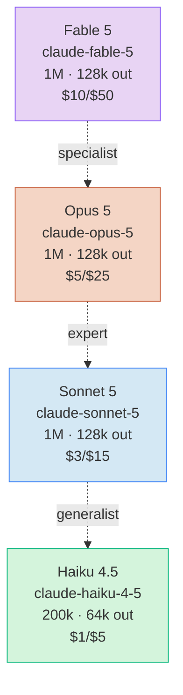

# 模型概览

> **TL;DR**：Claude 当前活跃 4 条产品线——**Fable 5**（长链 agent 专家）/ **Opus 5**（旗舰推理）/ **Sonnet 5**（速度与智能平衡）/ **Haiku 4.5**（最快接近前沿）。本页是 API/SDK 视角的全貌，详细定位见各模型详解。

⏱ 预计阅读时间：5 分钟

## 你能在这里学到

- 4 条产品线在 API 层的 Model ID、定价、context window
- 每个模型支持的**能力组合**（adaptive thinking / prompt caching / batch / tool use / vision）
- 官方"比喻式定位"（specialist / expert / generalist / fastest）
- Legacy 模型的快速索引与不再推荐的原因

## 一、家族谱系



> 完整定价与上下文说明见 [模型选型](/claude-capabilities/models/choosing-model)；CLI 视角的 `/model` / `/effort` 与 provider 差异表见 [Claude Code · 模型选择](/claude-code/basics/model-selection)。

## 二、当前活跃 4 条产品线（API 视角速查）

| 模型 | Model ID | Context | Max output | Pricing（输入/输出 $ / 1M tok） | 何时用 |
| --- | --- | --- | --- | --- | --- |
| **Fable 5** | `claude-fable-5` | 1M | 128k | **$10 / $50** | 长链多步 agent；根因分析、outage 调试、架构决策 |
| **Opus 5** | `claude-opus-5` | 1M | 128k | $5 / $25 | 复杂 agentic 编程、陌生代码、企业级工作 |
| **Sonnet 5** | `claude-sonnet-5` | 1M | 128k | $3 / $15（introductory $2/$10 截至 2026-08-31） | 日常主力，80%+ 编程与对话任务 |
| **Haiku 4.5** | `claude-haiku-4-5` | 200k | 64k | $1 / $5 | 批处理、低延迟、subagent 快跑 |

**调用方式**（以 Python SDK 为例）：

```python
import anthropic
client = anthropic.Anthropic()

# 任选其一
msg = client.messages.create(
    model="claude-sonnet-5",           # 或 claude-opus-5 / claude-fable-5 / claude-haiku-4-5
    max_tokens=1024,
    messages=[{"role": "user", "content": "..."}],
)
```

## 三、官方比喻式定位

来自 [Anthropic Blog · Choosing a Claude model and effort level in Claude Code](https://claude.com/blog/claude-model-and-effort-level-in-claude-code)（访问于 2026-08-06）：

- **Fable = the specialist**——见过几乎没人见过的问题的顶级专家；长链条、多步骤工作中优势最大
- **Opus = the expert**——领域专家；在陌生代码里靠模式识别就能帮你
- **Sonnet = a really good generalist**——优秀通才；给足上下文能透彻理解你的具体代码
- **Haiku** = the fastest near-frontier——主打"最快接近前沿"

## 四、API 能力矩阵（哪些模型支持什么）

| 能力 | Fable 5 | Opus 5 | Sonnet 5 | Haiku 4.5 |
| --- | :---: | :---: | :---: | :---: |
| **Adaptive thinking** | ✅ 总是开 | ✅ | ✅ | ❌ |
| **Extended thinking** | ❌ | ❌ | ❌ | ✅ |
| **Prompt Caching** | ✅ | ✅ | ✅ | ✅ |
| **Message Batches API** | ✅ | ✅ | ✅ | ✅ |
| **Tool use** | ✅ | ✅ | ✅ | ✅ |
| **Vision（图片）** | ✅ | ✅ | ✅ | ✅ |
| **PDF 输入** | ✅ | ✅ | ✅ | ✅ |
| **Structured Outputs** | ✅ | ✅ | ✅ | ✅ |
| **1M context** | ✅ | ✅ | ✅ | ❌（200k） |

> 详细 API 字段与请求结构见 v0.3.2 段的 API 9 篇（[Messages API](/claude-capabilities/api/messages) 等）。

## 五、选型快速决策树

```
问题 → 这是什么任务？
  │
  ├─ 长链 agent / 根因分析 / 多步 debug ──────────── Fable 5
  │
  ├─ 复杂 agentic 编程 / 陌生代码 / 架构决策 ────── Opus 5
  │
  ├─ 日常编程 / 文档 / 通用对话（80%+ 场景）────── Sonnet 5（默认）
  │
  └─ 批量 / 延迟敏感 / subagent 编排 ──────────── Haiku 4.5
```

**反直觉**：用 Sonnet 反复迭代可能比 Opus 少步数直接搞定更贵——大模型少步数总成本可能更低。详细成本计算见 [成本与 Token 管理](/claude-code/basics/cost-and-tokens)。

## 六、Legacy 模型索引

下表模型**不再推荐用于新项目**——保留只为历史参考与旧代码迁移：

| 模型 | Model ID 模式 | 状态 | 不再推荐理由 |
| --- | --- | --- | --- |
| Claude 2 / 2.1 | `claude-2*` | 已下线 | Sonnet 5 在所有维度都更优，价格更低 |
| Claude Instant | `claude-instant-*` | 已下线 | 速度优势被 Haiku 4.5 全面超越 |
| Opus 4.6 / 4.8 | `claude-opus-4-6` / `claude-opus-4-8` | 历史档 | Opus 5 已升级 token 效率与 1M context 稳定性 |
| Sonnet 4.5 / 4.6 | `claude-sonnet-4-5` / `claude-sonnet-4-6` | 历史档 | Sonnet 5 在 coding benchmark 上提升明显 |
| Haiku 3.5 / 4 | `claude-haiku-3-5` / `claude-haiku-4-*` | 历史档 | Haiku 4.5 接近 Sonnet 4 智能水平 |

**迁移建议**：`opus` / `sonnet` / `haiku` alias 在 Anthropic API 上**已自动解析为最新版本**——老代码无需改 Model ID；想 pin 老版本用 `ANTHROPIC_DEFAULT_OPUS_MODEL=claude-opus-4-6` 这类环境变量（见 [Claude Code · 模型选择 · Alias 在不同 provider 上](/claude-code/basics/model-selection#alias-在不同-provider-上解析不同-重要)）。

## 常见坑

**把 Model ID 写成 `-4-8` 而 Claude Code 默认是 `-5`**

Anthropic API 上 `claude-opus-4-8` 是历史 ID，新代码必须用 `claude-opus-5`。老 ID 调用会 404。

**Sonnet 5 上还写 `sonnet[1m]` 后缀**

Anthropic API 上 Sonnet 5 永远 1M context（200k + 1M prompt caching），`[1m]` 后缀是**冗余**。老 Sonnet 4.5 时代的习惯留着会误导读者。

**Alias 在 Bedrock / Vertex 解析不是 Sonnet 5**

`sonnet` 在 Amazon Bedrock 可能解析为 Sonnet 4.5、Claude Platform on AWS 解析为 Sonnet 4.6。跨云部署必须显式 pin：`ANTHROPIC_DEFAULT_SONNET_MODEL=claude-sonnet-5`。

## 参考

- [Anthropic Docs · Models overview](https://platform.claude.com/docs/en/about-claude/models/overview)（访问于 2026-08-06）
- [Anthropic Docs · Model configuration](https://code.claude.com/docs/en/model-config)（访问于 2026-08-06）
- [Anthropic Blog · Choosing a Claude model and effort level in Claude Code](https://claude.com/blog/claude-model-and-effort-level-in-claude-code)（访问于 2026-08-06）
- [CLI 视角选型与 `/model` / `/effort`](/claude-code/basics/model-selection)

## 下一步

- 详细成本与决策 → [模型选型（API 视角）](./choosing-model)
- 看旗舰推理 → [Opus 5](./opus)
- 主力日常 → [Sonnet 5](./sonnet)

## 如果你想

- 速度优先场景 → [Haiku 4.5](./haiku)
- 长链 agent 专家 → [Fable 5](./fable)
- 切到 API 视角调用细节 → [Messages API](/claude-capabilities/api/messages)
