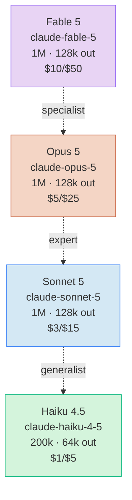

# 模型概览

> **TL;DR**：Claude 当前活跃 4 条产品线——**Fable 5**（长链 agent 专家）/ **Opus 5**（旗舰推理）/ **Sonnet 5**（速度与智能平衡）/ **Haiku 4.5**（最快接近前沿）。本页是 API/SDK 视角的全貌与多维度选型指南。

⏱ 预计阅读时间：8 分钟

## 你能在这里学到

- 4 条产品线在 API 层的 Model ID、定价、context window
- 每个模型支持的**能力组合**（adaptive thinking / prompt caching / batch / tool use / vision）
- 官方"比喻式定位"（specialist / expert / generalist / fastest）
- **多维度选型决策**（任务 / 成本 / 延迟 / 数据驻留 / 规模）
- Legacy 模型的快速索引与不再推荐的原因

## 一、家族谱系



> CLI 视角的 `/model` / `/effort` 与 provider 差异表见 [Claude Code · 模型选择](/claude-code/basics/model-selection)。

## 二、当前活跃 4 条产品线（API 视角速查）

| 模型 | Model ID | Context | Max output | Pricing（输入/输出 $ / 1M tok） | 何时用 |
| --- | --- | --- | --- | --- | --- |
| **Fable 5** | `claude-fable-5` | 1M | 128k | **$10 / $50** | 长链多步 agent；根因分析、outage 调试、架构决策 |
| **Opus 5** | `claude-opus-5` | 1M | 128k | $5 / $25 | 复杂 agentic 编程、陌生代码、企业级工作 |
| **Sonnet 5** | `claude-sonnet-5` | 1M | 128k | $3 / $15（introductory $2/$10 截至 2026-08-31） | 日常主力，80%+ 编程与对话任务 |
| **Haiku 4.5** | `claude-haiku-4-5` | 200k | 64k | $1 / $5 | 批处理、低延迟、subagent 快跑 |

**调用方式**（以 Python SDK 为例）：

```python
import anthropic
client = anthropic.Anthropic()

# 任选其一
msg = client.messages.create(
    model="claude-sonnet-5",           # 或 claude-opus-5 / claude-fable-5 / claude-haiku-4-5
    max_tokens=1024,
    messages=[{"role": "user", "content": "..."}],
)
```

## 三、官方比喻式定位

来自 [Anthropic Blog · Choosing a Claude model and effort level in Claude Code](https://claude.com/blog/claude-model-and-effort-level-in-claude-code)（访问于 2026-08-06）：

- **Fable = the specialist**——见过几乎没人见过的问题的顶级专家；长链条、多步骤工作中优势最大
- **Opus = the expert**——领域专家；在陌生代码里靠模式识别就能帮你
- **Sonnet = a really good generalist**——优秀通才；给足上下文能透彻理解你的具体代码
- **Haiku** = the fastest near-frontier——主打"最快接近前沿"

## 四、API 能力矩阵（哪些模型支持什么）

| 能力 | Fable 5 | Opus 5 | Sonnet 5 | Haiku 4.5 |
| --- | :---: | :---: | :---: | :---: |
| **Adaptive thinking** | ✅ 总是开 | ✅ | ✅ | ❌ |
| **Extended thinking** | ❌ | ❌ | ❌ | ✅ |
| **Prompt Caching** | ✅ | ✅ | ✅ | ✅ |
| **Message Batches API** | ✅ | ✅ | ✅ | ✅ |
| **Tool use** | ✅ | ✅ | ✅ | ✅ |
| **Vision（图片）** | ✅ | ✅ | ✅ | ✅ |
| **PDF 输入** | ✅ | ✅ | ✅ | ✅ |
| **Structured Outputs** | ✅ | ✅ | ✅ | ✅ |
| **1M context** | ✅ | ✅ | ✅ | ❌（200k） |

> 详细 API 字段与请求结构见 v0.3.2 段的 API 9 篇（[Messages API](/claude-capabilities/api/messages) 等）。

## 五、选型决策指南

选型不是"哪个模型最聪明"，而是**多约束下的最优解**——任务类型、成本预算、延迟要求、数据驻留、规模五个维度。

```
                ┌─ 任务类型 ──────── 短对话 / 编程 / 长链 agent / 批量 / 视觉
                │
                ├─ 成本预算 ──────── 个人 $50/月 / 团队 $500/月 / 企业自定
                │
选型决策 ───────┼─ 延迟要求 ──────── < 200ms / < 2s / < 30s / 24h batch
                │
                ├─ 数据驻留 ──────── 普通 / ZDR（Zero data retention）
                │
                └─ 规模 ────────── PoC / 生产小流量 / 生产大流量 / 企业内网
```

### 按任务类型——直接抄的决策表

| 任务类型 | 首选 | 次选 | 不推荐 |
|---------|------|------|--------|
| 短对话（< 5 步） | Sonnet 5 | Haiku 4.5 | Opus 5、Fable 5（杀鸡用牛刀） |
| 日常编程（80% 场景） | **Sonnet 5** | Opus 5 | Fable 5 |
| 复杂编程（陌生代码 / 重构） | Opus 5 | Sonnet 5 + 多轮迭代 | Haiku 4.5 |
| 长链 agent（10+ 步） | Opus 5 | Sonnet 5 | Haiku 4.5 |
| 超长链 agent（30+ 步） | **Fable 5** | Opus 5 | Sonnet 5、Haiku 4.5 |
| 批量任务（> 1 万条） | Haiku 4.5 + Batch API | Haiku 4.5 online | Opus 5 / Fable 5（贵） |
| 分类 / 提取 / 格式化 | Haiku 4.5 | Sonnet 5 | Opus 5、Fable 5 |
| Vision（图 / PDF） | Sonnet 5 | Opus 5 | Haiku 4.5（如需深度理解） |
| 实时语音 / 视频流 | Haiku 4.5 streaming | Sonnet 5 | Opus 5、Fable 5（延迟） |

### 按成本预算——月度 token 估算

**个人开发者**（$50/月）：

```
日常 80% 任务用 Sonnet 5 → ~$7.5/月
+ 偶尔 Opus 5 处理大任务 → ~$5/月
= 总 ~$13/月，离 $50 预算很远
```

**小团队**（5-10 人，$500/月）：

```
每人每天 20 万输入 + 5 万输出 × 5 人 × 30 天
= 按 Sonnet 5 ≈ $202.5/月 + 偶尔 Opus 5 ≈ $100
= 总 ~$300/月，预算内
```

**生产大流量**（日均 100 万请求）：

```
60% Haiku 4.5 + 30% Sonnet 5 + 10% Opus 5 = ~$60k/月
+ Prompt Caching（50% 命中）→ 砍半 ≈ $30k/月
+ Batch API（50% off）→ 再砍 ≈ $22.5k/月
```

### 按延迟要求

| 延迟档 | 推荐 |
|--------|------|
| **< 200ms** | Haiku 4.5 streaming |
| **200ms - 2s** | Sonnet 5 streaming |
| **2s - 30s** | Opus 5 online |
| **30s - 数分钟** | Opus 5 / Fable 5 |
| **< 24h** | Batch API（50% off） |

**first-token latency 经验值**：

```
Haiku 4.5:  ~150ms    Sonnet 5: ~400ms
Opus 5:     ~800ms    Fable 5:  ~1.2s
```

### 按数据驻留（ZDR）

| 模型 | ZDR 支持 |
|------|---------|
| Opus 5 | ✅ |
| Sonnet 5 | ✅ |
| Haiku 4.5 | ✅ |
| **Fable 5** | ❌ 不支持 |

ZDR 环境下 Fable 5 直接 403——需要长链 agent 能力时 fallback 到 Opus 5。

### 按规模

| 阶段 | 策略 |
|------|------|
| **PoC** | 单一 Sonnet 5，别过早优化 |
| **小流量生产**（< 1 万/天） | Sonnet 5 + Opus 5 混搭，Prompt Caching 30%+ |
| **大流量生产**（> 10 万/天） | 三层分流 + Batch API + 跨 region |
| **企业内网** | 显式 pin Model ID + ZDR 必开 |

### 完整决策树

```
任务是什么？
  │
  ├─ 批量 / 分类 / 提取 ────────── Haiku 4.5 + Batch API
  │
  ├─ 短对话 / 文档 / 80% 编程 ── Sonnet 5（默认）
  │
  ├─ 复杂编程 / 陌生代码 ──────── Opus 5
  │
  └─ 长链多步 agent ────────────── Fable 5（如果预算允许）
                                    │
                                    ├─ ZDR？─── 改 Opus 5（Fable 不支持）
                                    │
                                    └─ 预算紧？─ 改 Opus 5
```

**反直觉**：用 Sonnet 反复迭代可能比 Opus 少步数直接搞定更贵——大模型少步数总成本可能更低。详细成本计算见 [成本与 Token 管理](/claude-code/basics/cost-and-tokens)。

## 六、Legacy 模型索引

下表模型**不再推荐用于新项目**——保留只为历史参考与旧代码迁移：

| 模型 | Model ID 模式 | 状态 | 不再推荐理由 |
| --- | --- | --- | --- |
| Claude 2 / 2.1 | `claude-2*` | 已下线 | Sonnet 5 在所有维度都更优，价格更低 |
| Claude Instant | `claude-instant-*` | 已下线 | 速度优势被 Haiku 4.5 全面超越 |
| Opus 4.6 / 4.8 | `claude-opus-4-6` / `claude-opus-4-8` | 历史档 | Opus 5 已升级 token 效率与 1M context 稳定性 |
| Sonnet 4.5 / 4.6 | `claude-sonnet-4-5` / `claude-sonnet-4-6` | 历史档 | Sonnet 5 在 coding benchmark 上提升明显 |
| Haiku 3.5 / 4 | `claude-haiku-3-5` / `claude-haiku-4-*` | 历史档 | Haiku 4.5 接近 Sonnet 4 智能水平 |

**迁移建议**：`opus` / `sonnet` / `haiku` alias 在 Anthropic API 上**已自动解析为最新版本**——老代码无需改 Model ID；想 pin 老版本用 `ANTHROPIC_DEFAULT_OPUS_MODEL=claude-opus-4-6` 这类环境变量（见 [Claude Code · 模型选择 · Alias 在不同 provider 上](/claude-code/basics/model-selection#alias-在不同-provider-上解析不同-重要)）。

## 常见坑

**「最贵 = 最好」**

Fable 5 适合长链 agent，但日常对话用 Fable 5 完全是浪费。选型核心是**任务复杂度匹配**，不是价格高低。

**只盯单价忽略步数**

Opus 5 单价是 Sonnet 5 的 1.7-2x，但任务完成步数可能少 50%——**总成本可能反而低**。看总账单别看单价。

**把 Model ID 写成 `-4-8` 而 Claude Code 默认是 `-5`**

Anthropic API 上 `claude-opus-4-8` 是历史 ID，新代码必须用 `claude-opus-5`。老 ID 调用会 404。

**Sonnet 5 上还写 `sonnet[1m]` 后缀**

Anthropic API 上 Sonnet 5 永远 1M context（200k + 1M prompt caching），`[1m]` 后缀是**冗余**。老 Sonnet 4.5 时代的习惯留着会误导读者。

**Alias 在 Bedrock / Vertex 解析不是 Sonnet 5**

`sonnet` 在 Amazon Bedrock 可能解析为 Sonnet 4.5、Claude Platform on AWS 解析为 Sonnet 4.6。跨云部署必须显式 pin：`ANTHROPIC_DEFAULT_SONNET_MODEL=claude-sonnet-5`。

**Batch API 拿来跑实时任务**

Batch 是 24h SLA，**不能**用于实时场景。误用会让用户等 24h。

**没测 cache 命中率就上 Prompt Caching**

Prompt Caching 不命中时反而增加 metadata 开销（首请求 + 5% token 写费）。先跑 1000 个真实请求估算命中率，< 30% 别上。

## 参考

- [Anthropic Docs · Models overview](https://platform.claude.com/docs/en/about-claude/models/overview)（访问于 2026-08-17）
- [Anthropic Docs · Model configuration](https://code.claude.com/docs/en/model-config)（访问于 2026-08-17）
- [Anthropic Docs · Pricing](https://platform.claude.com/docs/en/about-claude/pricing)（访问于 2026-08-17）
- [Anthropic Docs · Effort](https://platform.claude.com/docs/en/build-with-claude/effort)（访问于 2026-08-17）
- [Anthropic Docs · Data residency / ZDR](https://platform.claude.com/docs/en/build-with-claude/data-residency)（访问于 2026-08-17）
- [Anthropic Blog · Choosing a Claude model and effort level in Claude Code](https://claude.com/blog/claude-model-and-effort-level-in-claude-code)（访问于 2026-08-17）
- [CLI 视角选型与 `/model` / `/effort`](/claude-code/basics/model-selection)

## 下一步

- 切到 API 视角调用细节 → [Messages API](/claude-capabilities/api/messages)
- CLI 视角选型 → [Claude Code · 模型选择](/claude-code/basics/model-selection)

## 如果你想

- 深度提示工程 → [深度提示工程](/claude-capabilities/prompting/best-practices)
- 成本计算细节 → [成本与 Token 管理](/claude-code/basics/cost-and-tokens)
