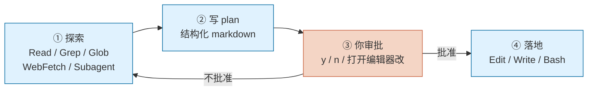

# Plan Mode

> **TL;DR**：Plan Mode 让 Claude Code **先只读探索、写完 plan、等你按 y 批准、再落地实施**。它把「改动前留在决策位」这件事从口头约定变成机制约束——Write / Edit / Bash 写操作在你批准前一律被拒。`Shift+Tab` 循环切入，状态栏出现 `⏸ plan mode on`。

⏱ 预计阅读时间：8 分钟

## 你能在这里学到

- Plan Mode 的三阶段（探索 / 计划 / 落地）
- 三种进入与四种离开方式
- 审批时的四个选项与它们各自会切到什么模式
- 一份好的 plan 长什么样（含本项目实例）
- 什么时候用、什么时候别用

## 前置

- 读完 [权限系统](./permissions)（Plan Mode 是权限模式家族里最"读者友好"的一档）
- 装好 Claude Code v2.1.203 或更高（旧版本状态栏 Manual 模式无徽章、`/plan` 前缀行为略有差异）

## 三阶段：探索 → 计划 → 落地

Plan Mode 的核心是把"改动之前"和"改动本身"分开：



阶段①②发生在 plan mode 内，写盘一律被拒；阶段③是你按 `1/2/3/4` 或 `Ctrl+G` 的那几秒；阶段④已经切到别的权限模式。

## 三种进入方式

| 方式 | 命令 | 用途 |
| --- | --- | --- |
| 启动即进入 | `claude --permission-mode plan` | 新开会话就打算规划 |
| 会话中切入 | `Shift+Tab` 循环到 `plan` | 边聊边发现需要退一步 |
| 单条 prompt 前缀 | `/plan <你的需求>` | 只想让一次回复进 plan 模式 |

`Shift+Tab` 的默认循环是 `default → acceptEdits → plan`；开启 `auto` / `bypassPermissions` 后它们会插入 `plan` 之后。状态栏在 plan 模式下显示 `⏸ plan mode on`。

想把 plan 设为项目默认，在 `.claude/settings.json` 写：

```json
{
  "permissions": {
    "defaultMode": "plan"
  }
}
```

## Plan Mode 里能做什么、不能做什么

**能**：Read、Grep、Glob、WebFetch、WebSearch、Task（派生 subagent 探索）、AskUserQuestion，以及内置的一批只读 Bash 命令（`ls` / `git log` / `cat` 等）。

**不能**：Write、Edit、MultiEdit、NotebookEdit、以及任何超出只读范围的 Bash 命令。

Shell 命令的判定有个新变化：v2.1.218 起，若你账号可用 auto mode 且 `useAutoModeDuringPlan` 保持默认开启，plan 模式里 shell 命令由**分类器**放行（不会打断你），否则一律 prompt。这项设置让 plan 阶段可以放心让 Claude 跑 `pnpm test` / `git diff` 这类命令去核实假设。

## 审批时的四个选项

写完 plan 后 Claude 会调 `ExitPlanMode` 工具，屏幕上出现选择菜单：

| 选项 | 你按 | 之后切到的模式 |
| --- | --- | --- |
| Yes, and use auto mode | `1` | `auto`（auto 不可用时按钮读作 "Yes, auto-accept edits" 切 `acceptEdits`；bypass permissions 会话读作 "Yes, and bypass permissions"） |
| Yes, manually approve edits | `2` | `default`（每次 Write/Edit 都问你） |
| No, refine with Ultraplan on Claude Code on the web | `3` | 把 plan 送到浏览器上继续打磨 |
| No, keep planning | `4` | 留在 plan 模式，告诉 Claude 改哪里 |

批准前按 `Ctrl+G` 会用你的默认编辑器（`$EDITOR`）打开 plan 让你直接改——比让 Claude 反复迭代更快。

批准后 Claude Code 会用 plan 内容**自动给会话命名**（除非你已 `--name` 或 `/rename`）；开启 `showClearContextOnPlanAccept` 设置后菜单会多一个"批准并清空 context"选项，能显著降低落地阶段的 token 消耗。

想离开 plan 但不批准：再按一次 `Shift+Tab` 循环到下一档即可。

## 一份好的 plan 长什么样

不是所有 plan 都值得批准。好的 plan 有五段：

1. **Context**：当前状态、这个改动的动机、边界（"本次不做什么"很重要）
2. **关键决策**：多个技术路线之间的抉择，附一句话理由
3. **改动清单**：具体到文件路径的目录树 + 哪些文件写实内容、哪些用 stub
4. **验证方式**：改完怎么知道对了（构建通过 / 死链 0 / 手动跑通某场景）
5. **风险与后续注意事项**：已知未解决的问题、下一步要跟进的项

**本项目就是用 Plan Mode 落地的**——v0.1 的整站骨架、100 个占位页、5 篇写作规范都由一份 plan 定义清楚后一次性执行。plan 文件在 [contributing/roadmap.md](/contributing/roadmap) 里做了浓缩版归档。

## 什么时候用、什么时候别用

**该用**：

- 跨文件重构、迁移旧 API、修改公共接口
- 破坏性变更（改 schema、删配置、动数据库）
- 新功能设计——尤其你自己也没想清楚的时候
- 需要大量搜索定位再动手的场景
- **让 Claude 帮你思考**而不只是执行

**别用**：

- Typo 或单行明确修复
- 机械替换（`grep -r "old" | xargs sed`）
- 已经写过一遍很确定的重复任务
- 探索性对话（"这个函数为啥这么写？"——直接问，别过度形式化）

## 常见坑

- **plan 太长读者不看**：控制在 3–5 屏内。给推荐方案而不是罗列 A/B/C 让用户选——你决策不了的东西别甩给读者
- **写盘工具被拒时 Claude 会道歉重试**：这是设计。你只需回一句"进 plan mode"，别陷入"为什么这条命令不行"的循环
- **在 ExitPlanMode 前不要用 AskUserQuestion 问「plan 好不好」**：ExitPlanMode 就是干这个的，重复问会让你按两次
- **Ultraplan 会把 plan 传到浏览器**：涉密项目别选这项
- **Subagent 的 permissionMode frontmatter 在 auto mode 下被忽略**：不能用它绕开 plan 限制；plan 模式的意图对整个会话生效
- **`--permission-mode plan` 与 `--dangerously-skip-permissions` 互斥**：headless 场景想 plan 得单独 `-p --permission-mode plan`

## 参考

- Anthropic Docs · [Choose a permission mode § Plan mode](https://code.claude.com/docs/en/permission-modes#analyze-before-you-edit-with-plan-mode)（访问于 2026-07-28）
- Anthropic Docs · [Common workflows § Plan before editing](https://code.claude.com/docs/en/common-workflows#plan-before-editing)（访问于 2026-07-28）
- Anthropic Docs · [Ultraplan](https://code.claude.com/docs/en/ultraplan)（访问于 2026-07-28）

## 下一步

- 摸清 Claude Code 的工具箱 → [工具总览](/claude-code/tools/overview) 🚧
- 学习如何用 `/permissions` 精细控制放行规则 → [权限系统](./permissions)

## 如果你想

- 配合 Explore / Plan Subagent 一起用 → [什么是 Subagent](/claude-code/subagents-and-workflows/what-is-a-subagent) 🚧
- 用 Plan Mode 节省成本（探索阶段用 Opus、落地阶段用 Sonnet） → [成本与 Token 管理 § 降本策略](./cost-and-tokens#四、9-条降本策略)
- 看真实的 plan 文件长什么样 → [路线图 § v0.1 段](/contributing/roadmap#v0-1-·-站点骨架与写作元规范-当前)
