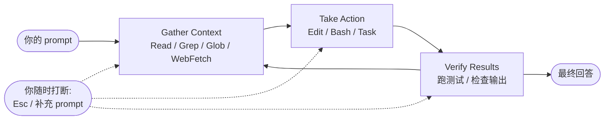
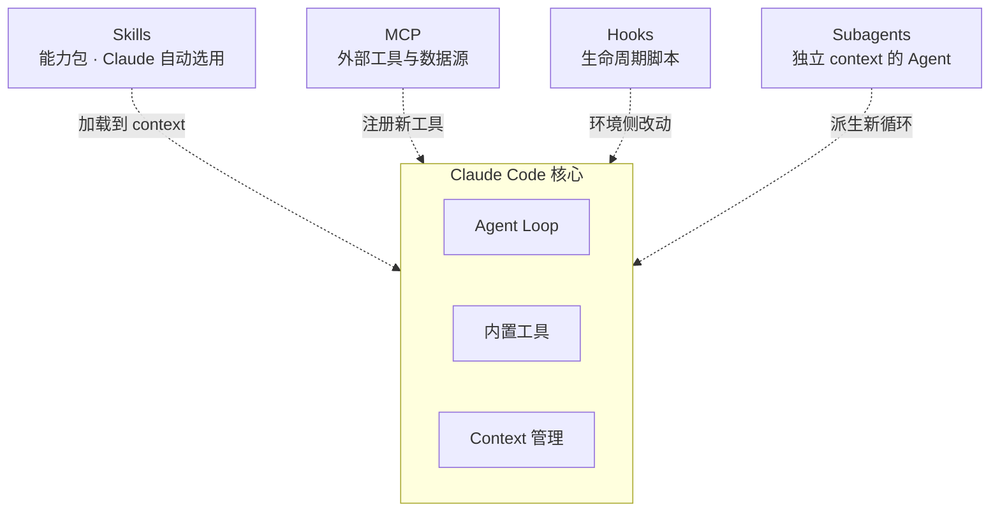

# 心智模型

> **TL;DR**：Claude Code 是一个 **agentic harness**——Claude 模型 + 内置工具 + 上下文管理 + 执行环境。你给它目标，它在 **Gather → Action → Verify** 三阶段循环里自主推进，直到任务完成。你随时可以打断、纠正、回退。

⏱ 预计阅读时间：8 分钟

> ⭐ 这是全站最重要的一页之一。读完你能预测 Claude Code 在任何场景下的行为。

## 你能在这里学到

- Claude Code 的 agentic loop 三阶段
- 一次 turn 里模型看到了什么（context 构成）
- 内置工具的五大类与它们的角色
- Skill / MCP / Hook / Subagent 在这个模型的哪一层
- Auto-compact / Checkpoints 两个安全网
- 三个常见误解与澄清

## 一、Claude Code = agentic harness

先记住一句话：**Claude Code 不是聊天机器人，是一个 harness（外壳）**——它把 Claude 模型放进一个能读文件、跑命令、调工具、管上下文的执行环境里，让语言模型变成一个能干活的 agent。

这个 harness 由两个核心组件构成：

- **模型（Claude Opus / Sonnet / Haiku / Fable）**：负责推理与决策——「下一步该干什么」
- **工具（Read / Edit / Bash / Grep / Task / …）**：负责动作——把决策落到你的机器上

> 引自 [Anthropic Docs · How Claude Code works](https://code.claude.com/docs/en/how-claude-code-works)：
> "Without tools, Claude can only respond with text. With tools, Claude can act." （访问于 2026-07-28）

## 二、Agent Loop：Gather → Action → Verify

你给 Claude 一个任务，它按三阶段自动推进：

三阶段是**混合、可循环**的：

- 一个「这个项目在做什么？」的问题——可能只需要 Gather
- 一个 bug 修复——三阶段反复循环几十次
- 一个 refactor——大量 Verify

每一步的工具输出会喂给模型下一步的决策，这就是「agent」的含义：模型自己 chain 出十几步动作，边走边根据反馈调整。

**你也是循环的一部分**：

- 按 **`Esc`** 立即停下当前工具调用，Claude 等你新指令
- 直接**打字加回车**是"补充指令"，Claude 完成当前动作后读你的补充再决定下一步

## 三、上下文里有什么

Claude 每一 turn 都要重新读所有历史。**一次调用的输入 = 一次上下文的完整拷贝**：

| 组成 | 来源 |
| --- | --- |
| System prompt | Claude Code 内置 |
| CLAUDE.md 三级 | 企业 / 用户（`~/.claude/CLAUDE.md`）/ 项目（仓库根） |
| Auto memory | `MEMORY.md` 前 200 行或 25 KB |
| 会话历史 | 往复消息 + 工具调用与结果 |
| 工具定义 | 内置 + MCP（MCP 是 deferred，先只加载工具名） |
| Loaded Skills | 描述在会话开头就加载，正文按需展开 |
| 你的当前 prompt | 你刚敲下去的 |

**这也是为什么 [Prompt Caching](/claude-capabilities/api/prompt-caching) 那么重要**——每一 turn 都在「重读」上下文，Caching 让重读几乎免费（成本降到原来 ~10%）。运行 `/context` 可以看谁在占空间，`/mcp` 看每个 MCP server 的 token 花销。

### 上下文用完了怎么办：Auto-compact

会话越长 context 越大。接近上限时 Claude Code 自动 compact：

1. 先清最老的工具输出
2. 不够就把老对话摘要化
3. 你的原始请求与关键代码片段被保留，但**早期的详细指令可能丢失**

**推论**：别指望 Claude 靠对话历史长期记住规则——规则要写进 [CLAUDE.md](/claude-code/basics/claude-md)。想控制 compact 保留什么，在 CLAUDE.md 加一段 `## Compact Instructions`，或用 `/compact focus on ...` 指定重点。

## 四、内置工具的五大类

按官方 [Tools reference](https://code.claude.com/docs/en/tools-reference) 分类：

| 类别 | 能力 | 代表工具 |
| --- | --- | --- |
| **File operations** | 读 / 编辑 / 创建 / 重命名 | Read / Write / Edit |
| **Search** | 按 pattern 找文件、内容搜索 | Grep / Glob |
| **Execution** | 跑 shell、启动 server、跑测试、用 git | Bash |
| **Web** | 搜索网络、抓文档、查错误消息 | WebFetch / WebSearch |
| **Code intelligence** | 类型错误、跳转定义、找引用 | 需装插件 |

另外还有 orchestration 类：`Task`（派 [Subagent](/claude-code/subagents-and-workflows/what-is-a-subagent)）、`TodoWrite`（自管进度）等。工具全表见 [工具总览](/claude-code/tools/overview)。

## 五、扩展点在哪一层

四个扩展点都是**建在核心之上的一层**，不是替代品：

- **[Skill](/claude-code/skills/what-is-a-skill)** — 让 Claude 在恰当时刻自动使用某段能力
- **[MCP](/claude-code/mcp/what-is-mcp)** — 注册来自外部服务的新工具（Google Drive / Jira / 自建）
- **[Hook](/claude-code/customization/hooks)** — 在工具调用前后跑你的脚本，改**环境**，不改 Claude
- **[Subagent](/claude-code/subagents-and-workflows/what-is-a-subagent)** — 派生独立 context 的新循环，做完返回摘要给主 Agent

四者选型见 [Skill vs Command vs Agent](/claude-code/skills/skills-vs-commands-vs-agents)。

## 六、两个安全网

**Checkpoints（文件回退）**

文件编辑前 Claude 会 snapshot 一份原始内容。按 **`Esc` 二次**可以回退到某个之前的状态。这与 git 无关、独立机制。**注意**：只覆盖文件改动，**不能撤销**数据库/API/部署等外部副作用——这也是为什么 Claude 会在跑有外部影响的命令时先问你。

**Permission Modes（4 档权限）**

按 `Shift+Tab` 循环切换：

- **Manual**：改文件、跑 shell 都先问你（默认）
- **Accept edits**：自动接受文件编辑与常用 fs 命令（`mkdir` / `mv`），其他仍问
- **Plan**：只探索 + 提议，不改任何文件（详见 [Plan Mode](/claude-code/basics/plan-mode)）
- **Auto**：后台安全检查 + 拦截高风险（部分账号可用）

细节见 [权限系统](/claude-code/basics/permissions)。

## 七、三个常见误解

**误解一：Claude Code 是聊天 REPL**

REPL 每次输入独立。Claude Code 是 Agent Loop，**每次工具调用之后模型都要再看一遍完整历史**。这就是为什么长会话很贵、为什么 Prompt Caching 是刚需、为什么该定期 `/compact`。

**误解二：Skill 是插件**

Skill 只是一份 markdown（含 description + 可选附件）——**它不 hook 到任何生命周期，也不注入运行时逻辑**。Claude 根据 description 判断是否加载它进上下文，然后按里面写的步骤办事。它更像「给 Claude 看的说明书」，不是「给 Claude 装的 App」。

**误解三：Hook 改变了 Claude 的行为**

Hook 修改的是**环境**——在工具调用前/后跑你写的脚本（比如自动 lint、自动测试）。Claude 本身的推理不受 Hook 影响。它是「在旁边看着 + 偶尔搭把手的助手」，不是「模型级别的修改」。

## 参考

- [Anthropic Docs · How Claude Code works](https://code.claude.com/docs/en/how-claude-code-works)（访问于 2026-07-28）
- [Anthropic Docs · Tools reference](https://code.claude.com/docs/en/tools-reference)（访问于 2026-07-28）
- [Anthropic Docs · Checkpointing](https://code.claude.com/docs/en/checkpointing)（访问于 2026-07-28）
- [Anthropic Docs · Memory & CLAUDE.md](https://code.claude.com/docs/en/memory)（访问于 2026-07-28）
- [Anthropic Docs · Context window](https://code.claude.com/docs/en/context-window)（访问于 2026-07-28）

## 下一步

- 决定要不要迁移到 Claude Code → [对比 Cursor / Copilot / Codex CLI](./comparisons)
- 开始正式学 → [Claude Code 基础](/claude-code/)

## 如果你想

- 深入 CLAUDE.md 三级继承 → [CLAUDE.md 项目记忆](/claude-code/basics/claude-md)
- 学 Skills / MCP / Hooks 的边界 → [Skill vs Command vs Agent](/claude-code/skills/skills-vs-commands-vs-agents)
- 理解 auto-compact 与成本 → [成本与 Token 管理](/claude-code/basics/cost-and-tokens)
- 立即上手一个真实任务 → [Cookbook · 第一个真实任务](/cookbook/first-real-task)
