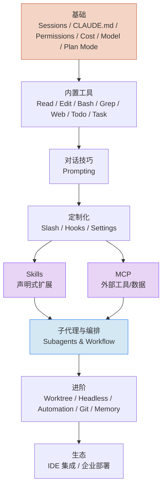

# Claude Code

> 这里是 Claude Handbook 的主战场。**Claude Code** 是 Anthropic 官方 CLI，把 Claude 塞进你的终端与项目。

## 谁应该读这一章

- 已经跑过 Hello World，想系统掌握它的完整能力
- 想学 Skills / MCP / Hooks / Subagents / Workflow 这些扩展点
- 想让 Claude Code 稳定地做真实项目里的活

如果你完全没接触过，请先去 [入门](/getting-started/)。

## 学习路径依赖图

各子章节之间有相对固定的前置依赖，建议按图中箭头顺序阅读：

- **橙色** 是所有后续内容的地基，一定先读
- **紫色**（Skills / MCP）是扩展生态的两条主线，可平行学
- **蓝色**（Subagents & Workflow）依赖前面所有概念

## 分组概览

**基础** — Claude Code 每天都用得到的六个基本概念  
**内置工具** — Claude 手里那把工具箱，逐个讲明白  
**对话技巧** — 怎么和 CLI 说话才高效  
**定制化** — Slash Command / Hook / settings.json 三板斧  
**Skills** — 声明式扩展的完整体系  
**MCP** — 让 Claude 用上你自己的工具与数据源  
**子代理与编排** — 派生 Agent、并行、Workflow 脚本  
**进阶** — Worktree、Headless、后台/定时、Git 工作流、全局记忆  
**生态** — IDE 插件、企业部署（Bedrock / Vertex / SSO）

## 从哪里开始

**如果你想马上产出一次真实成果：**

1. 装好 Claude Code（[入门 · 安装](/getting-started/installation)）
2. 读 [CLAUDE.md 项目记忆](./basics/claude-md)，给你的项目写一份
3. 读 [权限系统](./basics/permissions)，把权限调到刚好舒适
4. 读 [Plan Mode](./basics/plan-mode)，学会先规划再落地

**如果你想扩展 Claude Code：**

- Skills 与 Slash Commands 二选一入门：小任务用 Slash Command，跨会话复用用 Skill
- 想接入自家系统 → MCP
- 想让一个复杂任务并行拆解 → Subagents / Workflow

## 下一步

- 直接开始 → [基础 · 会话 Session](./basics/sessions)
- 换视角 → [Claude 能力全景](/claude-capabilities/)
- 查具体命令 → [定制与扩展 · Slash Commands](/claude-code/customization/slash-commands)

## 如果你想

- 快速上手（不看细节） → [Cookbook · 第一个真实任务](/cookbook/first-real-task)
- 只学 Skill → [什么是 Skill](./skills/what-is-a-skill)
- 只学 MCP → [什么是 MCP](./mcp/what-is-mcp)
