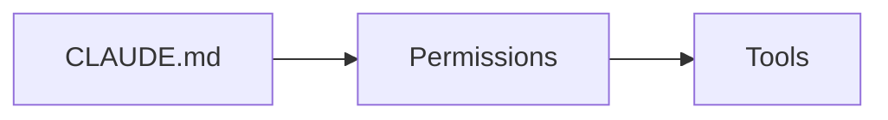

# 写作规范

> 每写一篇新文档之前，先读一遍这份规范；每次改老文档，也顺手核对一遍这里的清单。

本站定位是一份**中文语境下、可长期维护的、有观点的**学习资料。规范存在的目的不是束缚表达，而是让读者在任何一页都能得到一致的阅读体验，也让我未来回看老文档时能一眼看出「这篇过时了没有」。

::: tip 用 Claude Code 参与本项目？
根目录的 [CLAUDE.md](https://coding.jd.com/sz-fe/claude-wiki/blob/main/CLAUDE.md) 会被 Claude Code 每次会话自动加载。它是本规范的**红线摘要**，聚焦"下一步该做什么"与"已知坑"，与本文互补。
:::

## 目录

[[toc]]

## 一、文档结构

**推荐结构（顺序固定）：**

```
1. Frontmatter（元数据）
2. H1 标题（与 frontmatter.title 一致）
3. TL;DR / 一句话结论（引用块 >）
4. 你能在这里学到（3–5 条）
5. 前置知识（列出依赖章节）
6. 正文（H2/H3 层级清晰）
7. 常见问题 FAQ（可选）
8. 下一步（线性路径）+ 「如果你想…请去…」（横向跳转）
9. 参考（外链 + 访问日期）
```

**结构约束：**

- H1 只有一个，与 `title` 一致
- H2 之间不留超长段落，超过就拆
- 每篇建议 **1500 汉字以内**，超过就拆篇（拆篇后用「下一步」引导即可）
- 概念文用 [template-concept.md](./template-concept.md)，操作文用 [template-howto.md](./template-howto.md)

## 二、Frontmatter 强制字段

每篇 md 顶部必须有：

```yaml
---
title: 会话 Session
description: 一句话说明这篇讲什么、面向谁
audience: beginner        # beginner | intermediate | advanced
difficulty: 🟢            # 🟢 入门 | 🟡 进阶 | 🔴 高阶
status: draft             # planned | draft | published
lastUpdated: 2026-07-23
verifiedWith:
  claudeCode: 2.0.14      # 用哪个版本的 Claude Code 验证过
  model: claude-opus-4-8
  sdk: '@anthropic-ai/sdk@0.32.0'
---
```

**字段说明：**

| 字段 | 说明 |
| --- | --- |
| `audience` | 读者层次；决定是否解释术语 |
| `difficulty` | 直觉难度；用于筛选与导航徽章 |
| `status` | `planned` 尚未开写 / `draft` 未完成 / `published` 已发布 |
| `lastUpdated` | 内容层最后一次修改日期（不是 mtime） |
| `verifiedWith` | 最后一次亲手验证时依赖的版本；缺失即视为「未验证」 |

## 三、时效性

> Claude 生态月度级更新，一篇过期的教程比没有教程更糟。

- **90 天未更新** → 页面顶部显示黄色横幅「本页最后核对于 xx 天前，请谨慎参考」
- **180 天未更新** → 显示红色横幅「本页可能已严重过时，建议核对官方文档」
- **破坏性变更** → 老内容前加 `> **⚠️ 已废弃（Since Claude Code 2.x）**：...`
- **每月一次** 官方文档扫描仪式：对 Anthropic changelog 做 diff，命中的文档打上 `needs-review` 标签

v0.1 阶段横幅先用 Markdown 引用块手动实现，后续做 Vue 组件自动化。

## 四、代码示例

**基本要求：**

- 完整可运行；不写只能读、不能跑的伪代码
- 顶部注释标注**最小可运行版本**：
  ```python
  # Python 3.11+, anthropic>=0.32.0
  # 最后验证 2026-07-23 with Claude Opus 4.8
  from anthropic import Anthropic
  ```
- API 调用示例附**成本估算**（一次调用约多少美元），帮读者建立成本直觉
- 敏感信息一律占位：`sk-ant-****`、`API_KEY=<your-key>`
- Shell 命令若需要交互确认，注释说明

**多语言形态：**

需要展示 curl / Python / TypeScript / Claude Code CLI 多种形态时，用 VitePress 的代码组：

````markdown
::: code-group

```python [Python]
# ...
```

```typescript [TypeScript]
// ...
```

```bash [curl]
# ...
```

:::
````

**命令行示例：**

- 提示符统一 `$`（不写 `>` 或 `#`）
- 用户输入与输出分开代码块，不混排
- 输出片段过长时用 `# ...` 省略中间行，保留首尾

## 五、术语与命名

**核心约束**：Claude / Anthropic / Claude Code 三者禁止混用。

| 词 | 指代 |
| --- | --- |
| **Claude** | 模型本身（Opus 4.8 / Sonnet 5 / Haiku 4.5 / Fable 5） |
| **Anthropic** | 出品公司 |
| **Claude Code** | Anthropic 出品的 CLI 工具，底层调用 Claude 模型 |

首次出现时按上表边界说明，之后按语境使用。

**其他约束：**

- 中文首选；专有名词保留英文原文（`Claude Code`、`Skill`、`MCP`、`Hook`、`Subagent`、`Slash Command`、`CLAUDE.md`、`Plan Mode`、`Worktree`）
- 中英混排前后加**半角空格**：`使用 Claude Code 完成任务`
- 术语必须与 [glossary.md](./glossary.md) 对齐；发现术语表未覆盖时先补表，再写正文
- 禁止别名：不要「技能 / Skill」两种写法混用，除非首次出现时说明「Skill（技能）」

## 六、图示与截图

**优先级：Mermaid > 手绘 SVG > 截图。**

**Mermaid：** 用于流程图、时序图、依赖图。VitePress 原生支持：

````markdown

````

**截图：**

- 统一浅色主题（用户可读性最好，也便于在打印/PDF 里辨认）
- 打码必查项：路径中的用户名、真实项目名、API Key、Token、内网域名
- 归档到 `assets/screenshots/YYYY-MM-DD/xxx.png`，日期用**截图当天**，方便过期识别
- 每张截图对应源文件（如有）入库：`.excalidraw` / `.mermaid` / `.drawio`
- 必须有 `alt` 文本，颜色对比度符合 WCAG AA

## 七、读者引导

**每篇末尾除线性「下一步」外，增加横向跳转：**

```markdown
## 下一步

- 继续读 → [权限系统](/claude-code/basics/permissions)

## 如果你想

- 深入了解 Claude Code 内部工作机制 → [心智模型](/getting-started/mental-model)
- 学习如何写第一个 Skill → [写你的第一个 Skill](/claude-code/skills/custom-skill)
- 处理成本问题 → [成本与 Token 管理](/claude-code/basics/cost-and-tokens)
```

**每章 `index.md` 应有一张 mermaid 依赖图**，用来告诉读者「该章内部页面的推荐阅读顺序 + 前置依赖」。

## 八、不写什么

> 一份好的 Wiki 是「删」出来的，不是「写」出来的。

- **不重复 Anthropic 官方 API schema 全表**：只写「为什么用 / 何时用 / 踩坑」，schema 用链接指向官方文档
- **不做翻译搬运**：官方英文文档 SEO 极强，中文站的差异化竞争在于「场景化案例 + 踩坑记录 + 中文语境技巧」
- **不写「教程博客」**：Cookbook 案例必须是**别处查不到的场景**且**近 90 天内可复现**
- **不硬编码 model id**：一律引用 [reference/model-ids.md](../reference/model-ids.md) 的变量，避免模型改名导致全站失效

## 九、法律与署名

- 引用 Anthropic 官方文本必须带**永久链接 + 访问日期**：
  ```markdown
  > 引自 [Anthropic Docs · Tool Use](https://docs.claude.com/en/docs/tool-use)（访问于 2026-07-20）
  ```
- 免责声明：本站与 Anthropic 无官方关联
- 内容许可：CC BY-SA 4.0；代码许可：MIT
- 用 Claude 生成的示例代码，作者对准确性负责，与 Anthropic 无关

## 十、PR 前自检 checklist

新文档 / 修改老文档合入前，请对照本清单逐项核对：

> **具体操作**：本节列的是「要检查什么」；每项**怎么检查、判据、失败怎么办**，见 [Published 门槛自检模板](./checklist-published)——把 draft 升到 published 时逐项跑。

- [ ] Frontmatter 完整，`verifiedWith` 与实际验证一致
- [ ] `status` 已从 `planned` 或 `draft` 更新为 `published`
- [ ] `lastUpdated` 与本次改动日期一致
- [ ] 术语与 [glossary.md](./glossary.md) 一致；未收录的术语已补录
- [ ] 代码示例在 `verifiedWith` 的版本下亲手跑过
- [ ] 敏感 key、内部路径、真实用户名已脱敏
- [ ] 所有外链可访问，官方文档链接标注访问日期
- [ ] 截图打码完整，源文件入库
- [ ] 中英混排前后有半角空格
- [ ] 「下一步」+「如果你想」两组引导齐备
- [ ] 字数 ≤ 1500 汉字；超过则已拆篇
- [ ] `pnpm build` 无报错、无死链

## 参考

- [VitePress 官方文档](https://vitepress.dev/)（访问于 2026-07-23）
- [Anthropic 文档站](https://docs.claude.com/)（访问于 2026-07-23）
- [Diátaxis 四象限文档框架](https://diataxis.fr/) — 概念文 / 操作文的划分参考

## 下一步

- 查术语 → [术语表](./glossary)
- 写新概念页 → [概念文模板](./template-concept)
- 写新操作页 → [操作文模板](./template-howto)
- 看整体进度 → [路线图](./roadmap)
