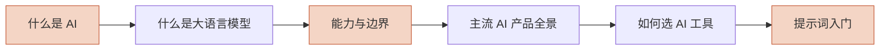

# AI 入门

> 没用过 AI 工具？从这里开始。整章按顺序读约 30 分钟，建立一张完整的地图。

## 谁应该读这一章

- **完全没接触过 AI** — 想搞清楚它是什么、能做什么、不能做什么
- **用过但没系统了解** — 想知道大模型为什么这么强、有哪些坑
- **想选工具的人** — 面对 ChatGPT / Claude / Gemini / 豆包无从下手，想要一张选型地图

如果你已经熟练使用 AI 工具，可以跳过本[章直接进入 [AI 核心技术](/ai-core/) 或 [产品动向](/ai-trends/)。

## 推荐阅读顺序

能力边界（图中橙色）是最值得仔细读的一页：**知道 AI 不行什么，比知道它能什么更重要**——大部分翻车都源于预期错位。

## 本章目录

| # | 页面 | 一句话 | 时长 |
| --- | --- | --- | --- |
| 1 | [什么是 AI](./what-is-ai) | 从符号 AI 到生成式 AI，一次快速历史散步 | 4 分钟 |
| 2 | [什么是大语言模型](./what-is-llm) | 非技术视角：模型是怎么练出来的、为什么这么强 | 5 分钟 |
| 3 | [能力与边界](./capabilities-and-limits) | 能做 / 不能做一张表——管理预期，避免翻车 | 6 分钟 |
| 4 | [主流 AI 产品全景](./ai-tools-landscape) | ChatGPT / Claude / Gemini / 豆包……一张地图 | 5 分钟 |
| 5 | [如何选择 AI 工具](./choosing-ai-tool) | 按场景选：对话 / 写作 / 编程 / 研究 / 企业 | 5 分钟 |
| 6 | [提示词入门](./prompting-basics) | 通用提示技巧，不绑定任何厂商 | 5 分钟 |

## 下一步

读完本章后：

- **想知道底层原理** → [AI 核心技术](/ai-core/)
- **想在编程中落地** → [AI Coding 落地](/ai-coding/)
- **想跟踪行业动态** → [AI 产品动向](/ai-trends/)

## 如果你想

- 深入了解某个厂商 → [国外厂商](/ai-trends/vendors/) / [国内厂商](/ai-trends/cn-vendors/)
- 直接开始用 Claude Code → [Claude Code 快速上手](/claude-code/getting-started/what-is-claude-code)
- 查术语中英对照 → [术语表](/contributing/glossary)
