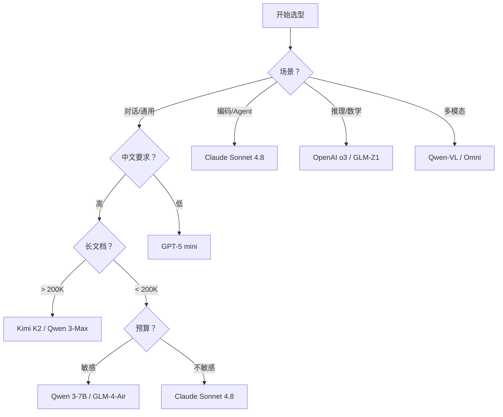

# 选型决策树

> **6 个维度、5 个决策点、1 张速查表**——看完就能选型，避开"过度选型"和"配置浪费"。

## 决策树：按 6 维度选



### 维度 1：场景

| 场景 | 首选 | 理由 |
|------|------|------|
| 通用对话 | Claude Sonnet 4.8 / GPT-5 mini | 性价比高，中英文都好 |
| 编码 + Agent | Claude Sonnet 4.8 | Tool Use + Agent 最完整 |
| 数学/代码推理 | OpenAI o3 / GLM-Z1 | RLVR 推理最强 |
| 长文档分析 | Kimi K2 / Qwen 3-Max | 2M/1M 上下文 |
| 多模态 | Qwen-VL / Omni | 全模态最完整 |

### 维度 2：中文要求

| 要求 | 首选 | 理由 |
|------|------|------|
| 高（中文原生） | Kimi / Qwen / GLM | 中文基准领先，中文文件解析原生 |
| 中（中英文均衡） | Claude Sonnet 4.8 | 中英文都好，Agent 最强 |
| 低（英文为主） | GPT-5 / Claude Opus 4.8 | 英文基准最高 |

### 维度 3：长文档

| 长度 | 首选 | 理由 |
|------|------|------|
| < 200K | 任意旗舰模型 | 都够用 |
| 200K - 1M | Claude Fable 5 / Qwen 3-Max | 1M 上下文 |
| > 1M | Kimi K2-0905 | 2M 上下文，唯一选择 |

### 维度 4：编码能力

| 需求 | 首选 | SWE-bench |
|------|------|-----------|
| 最强编码 | Claude Sonnet 4.8 | 72.7% |
| 编码 + 推理 | Claude Opus 4.8 | 79.4% |
| 开源编码 | Qwen-Coder | 68.3% |

### 维度 5：预算

| 预算 | 首选 | Input 价格 |
|------|------|-----------|
| 极低 | Qwen 3-0.5B（端侧） | 免费 |
| 低 | Qwen 3-7B / GLM-4-Air | ¥0.5/MTok |
| 中 | Claude Sonnet 4.8 / GPT-5 mini | $3-1.5/MTok |
| 高 | Claude Opus 4.8 / o3 | $15-20/MTok |

### 维度 6：部署

| 部署 | 首选 | 理由 |
|------|------|------|
| API 直调 | 任意厂商 | 都支持 |
| 海外企业私有 | Claude (Bedrock/Vertex) / GPT (Azure) | 云厂商集成 |
| 国内企业私有 | Qwen (阿里云) / GLM (智谱云) | 国产化 + 私有化 |
| 端侧/本地 | Qwen 3-7B / GLM-4-Air | 全尺寸开源 + 端侧优化 |

## 5 个常见决策点

### 1. "公司内 AI 助手选谁"

**需求**：中文 + 私有化 + 成本可控

**推荐**：Qwen 3-7B（阿里云部署）或 GLM-4.6（智谱 MaaS）

**理由**：全尺寸开源 + 国产化合规 + 成本低（¥0.5-5/MTok）

### 2. "个人 Claude Code 替代品"

**需求**：编码 + 工具调用 + 低成本

**推荐**：Claude Sonnet 4.8（$3/MTok）或 Qwen-Coder（开源）

**理由**：Claude Agent 最完整，Qwen-Coder 开源免费

### 3. "长 PDF / 合同分析"

**需求**：长上下文 + 文件解析 + 中文

**推荐**：Kimi K2（1M 上下文 + 文件解析）或 Qwen 3-Max（1M 上下文）

**理由**：Kimi 文件解析原生支持，Qwen 价格更低

### 4. "数学 / 物理 / 算法竞赛"

**需求**：推理能力最强

**推荐**：OpenAI o3（推理最强）或 GLM-Z1（中文推理最强）

**理由**：RLVR 训练，"想得更久 = 答得更准"

### 5. "国内业务 + 数据合规"

**需求**：国产化 + 私有化 + 数据不出境

**推荐**：Qwen（阿里云）或 GLM（智谱云）

**理由**：全尺寸开源 + 国内云厂商集成 + 数据合规

## 反向决策：哪些场景不该用 LLM

| 场景 | 问题 | 替代方案 |
|------|------|----------|
| 实时交易决策 | 延迟太高（100ms+） | 规则引擎 / 传统 ML |
| 精确数值计算 | 浮点误差 / 幻觉 | 计算器 / Wolfram Alpha |
| 法律/医疗诊断 | 责任归属不清 | 人工审核 + LLM 辅助 |
| 超大规模数据处理 | 成本太高 | 传统 ETL / Spark |

## 组合策略：Multi-model 路由

**思路**：便宜的模型处理简单任务，贵的模型处理复杂任务。

**示例路由**：

```
用户请求 → 简单分类？ → Qwen 3-7B（¥0.5/MTok）
         → 需要推理？ → Claude Opus 4.8（$15/MTok）
         → 长文档？  → Kimi K2（¥12/MTok）
```

**收益**：平均成本降低 60-80%，同时保持质量。

## 参考

- [5 厂商横向对比](./comparison) — 8 维度量化对比
- [技术架构总览](./architecture) — 4 大技术路线详解
- [5 厂商详情](./anthropic) · [openai](./openai) · [moonshot](./moonshot) · [zhipu](./zhipu) · [qwen](./qwen)

## 下一步

- 选完型想接 SDK → [Claude Code SDK](/claude-capabilities/sdk/claude-code-sdk)
- 看部署案例 → [Cookbook](/cookbook/)
- 深入某家厂商 → [Anthropic](./anthropic) / [OpenAI](./openai) / [Moonshot](./moonshot) / [Zhipu](./zhipu) / [Qwen](./qwen)
